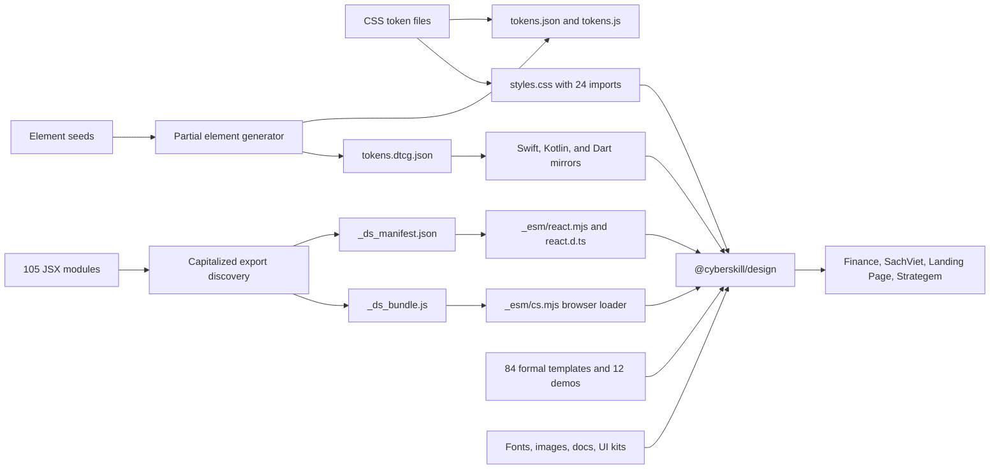
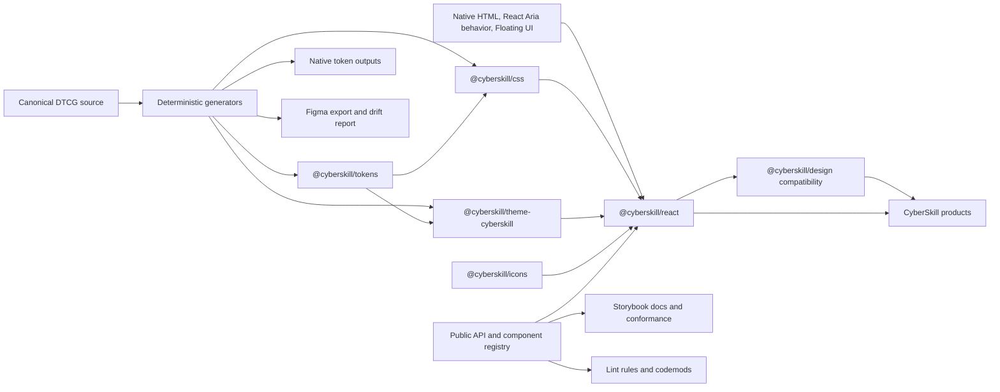

# CyberSkill Design System audit and 12-month evolution plan

## 1. Executive assessment

Audit date: 2026-07-28.

The current release does not meet an enterprise-grade claim. It has broad component coverage, deterministic generation checks, bilingual documentation, npm provenance, and a large test surface. Those strengths are offset by release controls that can report success without publishing, declarations that fail strict consumer compilation, unsafe HTML rendering, global CSS leakage, incomplete accessibility behavior, a two-language locale model, and four known consumers that remain on older or commit-pinned builds.

The highest-priority conclusions are:

- `@cyberskill/design@1.1.1` exists on npm, the registry tarball matches the tested repository artifact, and SLSA provenance is present.
- The published declarations fail strict TypeScript consumer checks. The current entry test checks text and export parity without compiling the declarations.
- `Editor` renders caller HTML without sanitation. This becomes a stored-XSS boundary when any consumer passes untrusted or remote HTML.
- Release automation accepts any `v*` tag and converts several publish failures into exit code 0.
- Only `fast-gates` and `docs-consistency-blocker` are required on `main`. Independent review, CODEOWNERS approval, signed commits, administrator enforcement, and conversation resolution are absent.
- The package contains 1,032 files and is 10.69 MB compressed. Templates and assets account for most of this size.
- The React entry publishes raw JSX, has no `"use client"` boundaries, and requires consumer-specific transpilation.
- System dark mode and high-contrast mode contain confirmed color failures, including measured contrast near 1.23:1 and 2.10:1.
- Several components declare ARIA widget roles without implementing the related keyboard model.
- The locale system maps every non-Vietnamese locale to English and links English to USD and Vietnamese to VND.
- Finance, SachViet, Landing Page, and Strategem are all behind the current release or use local wrappers, copied CSS, unsupported token names, or source-file imports.
- The audited maturity score is 2.10 out of 5 across 21 dimensions. This is a directional engineering score, not an external certification.

No repository file was changed. The pre-existing untracked `.cursor/`, `.devin/`, `.github/copilot-instructions.md`, `.grok/`, `.windsurf/`, and `dist/` paths remain untouched.

## 2. Repository and architecture map

Current Git and release state:

- `main`, `origin/main`, `HEAD`, and tag `v1.1.1` resolve to commit `0266444`.
- npm `latest` is `1.1.1`.
- The packed artifact SHA-1 matches the registry `dist.shasum`.
- The repository is public and has no GitHub Releases or active GitHub issues.
- Older `v1.5.0` and `v1.5.1` tags belong to an earlier package identity, while the current public package restarted at `1.0.0`. This leaves a confusing tag history.

Current architecture:



The token arrows describe intended authority. The repository has no general generator that recreates JSON and DTCG from the CSS sources. Element generation patches existing mirrors, while native generation treats DTCG as authoritative.

The source graph contains 116 JS or JSX files, 263 imports, 157 internal edges, and 106 React edges. No source cycle was found.

The public package has one runtime boundary:

- Root and `/react`: raw React source through `_esm/react.mjs`.
- `/legacy`: browser-only loader through `_esm/cs.mjs`.
- `/styles.css`, `/tokens/*`, the bundle, and the manifest.
- Components, templates, assets, docs, and guidelines are packed but are not exposed through normal package subpaths.

## 3. Complete audited inventory

### Component source inventory

All 105 primary JSX modules have matching declaration, prompt, and Figma mapping files.

| Group | Count | Components |
|---|---:|---|
| AI | 8 | AIDisclosureBadge, ChatMessage, CitationList, ConfidenceMeter, HumanReviewGate, PromptInput, PromptSuggestions, TypingIndicator |
| Brand | 1 | LumiAvatar |
| Buttons | 3 | Button, ButtonGroup, FloatingActionButton |
| Data | 26 | Accordion, AspectRatio, Avatar, Card, Carousel, Chart, CodeBlock, Collapsible, Comment, DescriptionList, Divider, Image, Item, Kbd, List, Masonry, QRCode, ScrollArea, Sortable, Splitter, Stat, Terminal, Timeline, Tooltip, Tree, Watermark |
| Data tables | 3 | DataGrid, DataTable, TreeTable |
| Dialog | 1 | Dialog |
| Feedback | 10 | Alert, Badge, EmptyState, ProgressBar, Result, Skeleton, Spinner, StatusIndicator, Tag, Toast |
| Forms | 28 | Calendar, Cascader, Checkbox, ColorPicker, Combobox, DatePicker, Editor, FileUpload, Form, InlineEdit, InputGroup, InputOTP, Mentions, NativeSelect, NumberField, RadioGroup, Rating, SearchField, SegmentedControl, Select, Slider, Switch, TagInput, Textarea, TimePicker, Toggle, Transfer, TreeSelect |
| Icon | 1 | Icon |
| Logo | 1 | Logo |
| Navigation | 15 | Anchor, BackTop, Breadcrumb, CommandPalette, Dock, HotKeys, Link, Menu, Menubar, NavigationMenu, Pagination, Sidebar, Steps, Tabs, Toolbar |
| Overlays | 7 | AlertDialog, ContextMenu, Drawer, HoverCard, Popconfirm, Popover, Tour |
| Text field | 1 | TextField |

The 16 additional root exports are AvatarGroup, CardHeader, CardBody, CardFooter, ListItem, ToastStack, FormField, FormFieldArray, FormWizard, Radio, CS_ICONS, CS_LOGO_VIEWBOX, CS_LOGO_MARK_INNER, MenuItem, NavItem, and Tab.

### Other inventory

| Area | Inventory | Audit status |
|---|---|---|
| Component files | 445 files: 105 JSX, 105 declarations, 105 prompts, 105 Figma files, 20 component cards, 5 helpers | Static audit complete; full runtime certification remains open |
| Public exports | 121 names | Export membership and declaration surface audited |
| Templates | 84 `.dc.html` templates and 12 demo or email-safe pages | Static and whole-set gate coverage audited; legal content correctness was outside this technical audit |
| Storybook | 133 story files; every primary referenced; 29 FullMatrix stories reported by current gates | Structure audited; interaction depth is partial |
| Audit system | 112 files | Gate ownership, browser scope, assertions, and required-check status audited |
| Tokens | 18 files; 146 DTCG leaves; native Swift, Kotlin, and Dart mirrors | Authority, categories, generation, provenance, and coverage audited |
| CSS | 25 files; 3,455 declarations | Cascade, global scope, raw values, responsiveness, modes, and delivery audited |
| Icons | 28 registry names plus local SVG and Unicode glyphs | Registry and duplicate-use pattern audited |
| Fonts | 45 WOFF2 files, about 536 KB | Loading, script coverage, packaging, and license evidence audited |
| Images | 10 files; four aurora PNGs total about 5.7 MB | Size, delivery, and rights metadata audited |
| Docs | English and Vietnamese operational documents, Storybook docs, status pages, task records | Freshness, parity, release communication, and gaps audited |
| Build output | `_ds_bundle.js` 331,300 bytes; 116 modules; 121 public exports | Bundle graph and freshness checks audited |
| Package | 1,032 files; 10,685,208 compressed bytes; 18,008,525 unpacked bytes | Pack contents and registry integrity audited |
| Consumers | Finance, SachViet, Landing Page, Strategem | Dependency state and static usage audited |
| Live Figma state | Secrets, file access, and real node mappings unavailable | Open investigation |
| Manual assistive technology | No current evidence set | Open investigation |
| Organization-level GitHub security | Repository-visible settings inspected; organization policy unavailable | Open investigation |

The 84 formal template names are: app-shell, article, auth, bod-deck, bod-investor-update, bod-memo, bod-minutes, bod-report, bod-resolution, culture-event-invite, dashboard, delivery-change-note, delivery-kickoff, delivery-qbr-deck, delivery-runbook, delivery-status-email, doc-style-guide, doc-suite-index, doc-templates, email, finance-dunning-email, finance-expense-report, finance-invoice, finance-quote, hr-announcement, hr-interview-kit, hr-offboarding, hr-performance-review, hr-pip, legal-msa, legal-sow, marketing-campaign-brief, marketing-case-study, marketing-launch, marketing-newsletter, marketing-page, marketing-press-release, marketing-social-kit, sales-one-pager, sales-proposal-deck, settings, slide-deck, team-meeting-agenda, tech-incident-report, tech-release-notes, tech-retro, tech-rfc, and 37 `vn-*` employment, policy, privacy, compensation, governance, and contracting templates.

## 4. Findings register

All paths in this register are relative to `/Users/stephencheng/Projects/CyberSkill/design-system`.

Priority uses P0 for immediate containment, P1 for foundational work, P2 for planned remediation, and P3 for expansion. Effort is rough sizing.

### Security, release, governance, and metadata

#### CDS-SEC-001 - Editor accepts executable HTML

- Classification and scope: Confirmed implementation flaw with probable exploit exposure; Critical; P0; `components/forms/Editor.jsx:10-23`.
- Evidence and behavior: `defaultValue` is inserted through `dangerouslySetInnerHTML`; updates emit `innerHTML`; the component uses deprecated `document.execCommand`. Expected behavior is a defined trust boundary with sanitized or schema-based content. The root cause is using HTML as an unrestricted value model.
- Risk: Likelihood depends on consumer input; impact can be stored XSS; blast radius includes every product rendering remote or user-authored editor content; confidence is high. Edge cases include event attributes, SVG payloads, `javascript:` URLs, pasted markup, and Trusted Types. Related: CDS-SEC-002 and CDS-FORM-001.
- Remediation: Sanitize by default, add explicit trusted-content APIs, then replace the editor with a schema-based implementation. A containment-only alternative keeps raw HTML behind an `unsafeHtml` API; its tradeoff is continuing application-level trust work. Dependencies: CSP policy and migration guidance.
- Verification and delivery: Security payload suite, CSP, Trusted Types, paste, selection, and keyboard tests. Effort 4-8 engineer-weeks. Phase 1. Reference: Spectrum behavior separation and OWASP-compatible sanitation practice.

#### CDS-SEC-002 - Unsafe template execution shares the main host boundary

- Classification and scope: Confirmed configuration risk; High; P1; `vercel.json:56-57`, `templates/*/support.js:774,1148`.
- Evidence and behavior: Main-host CSP permits `unsafe-inline` and `unsafe-eval`; every copied template runtime uses `new Function`. Expected behavior is a strict public documentation origin and isolated compiler execution. The root cause is combining docs, previews, editable HTML, and compiler tools under one origin.
- Risk: Likelihood is medium; impact is script execution if untrusted content reaches the preview; blast radius is the public host; confidence is high. Related: CDS-SEC-001 and CDS-HOST-001.
- Remediation: Move template execution to a separate origin or sandboxed iframe and apply a strict CSP to Storybook. Replacing dynamic evaluation is an alternative, but it may require more compiler work. Dependencies: separate template product boundary.
- Verification and delivery: CSP report-only trial, injection fixtures, iframe sandbox checks, and cross-origin tests. Effort 1-2 engineer-months. Phases 1-2. Reference: browser CSP and Trusted Types guidance.

#### CDS-SEC-003 - Supply-chain controls are incomplete

- Classification and scope: Confirmed repository state with an open organization-policy question; Medium; P1; workflow files and `package-lock.json`.
- Evidence and behavior: Actions use mutable major tags, release installs `npm@latest`, and `npm audit` reports three high dev findings through `@figma/code-connect`, `minimatch`, and `brace-expansion`. No repository SBOM, dependency-review, CodeQL, or OpenSSF job exists. Production dependency audit is clean.
- Risk: Likelihood is medium; impact is CI or release compromise; blast radius includes published packages; confidence is high for repository-visible controls. Related: CDS-REL-001 and CDS-GOV-001.
- Remediation: Pin Actions by SHA, pin npm and Node, isolate Code Connect, add dependency review, SBOM, code scanning, and secret scanning. Removing Figma tooling is an alternative with design-integration cost.
- Verification and delivery: Reproducible workflow lock, SPDX output, dependency-review test PR, and organization-setting audit. Effort 3-6 engineer-weeks. Phases 1-2. References: [npm trusted publishing](https://docs.npmjs.com/trusted-publishers/), [SLSA 1.2](https://slsa.dev/spec/v1.2/), and [OpenSSF Scorecard](https://openssf.org/scorecard/).

#### CDS-REL-001 - Release automation can succeed without publishing

- Classification and scope: Confirmed process defect; High; P0; `.github/workflows/npm-publish.yml:12-41`, `_audit/ci/npm-publish.mjs:24-54,118-141`.
- Evidence and behavior: Any `v*` tag or manual dispatch can publish. Authentication, permission, not-found, and version-conflict errors can exit 0. The job does not bind tag, package version, protected-main ancestry, gate SHA, and registry digest.
- Risk: Likelihood is medium; impact is a green release with no valid artifact or an incorrect tag association; blast radius covers all consumers; confidence is high. Related: CDS-REL-003 and CDS-META-001.
- Remediation: Require `v${package.version}`, protected-main ancestry, exact-SHA gates, one packed tarball, post-publish integrity verification, and fail-closed errors. Keeping soft skips is acceptable only for optional Figma operations.
- Verification and delivery: Negative tests for wrong tags, auth errors, duplicate versions, failed gates, registry mismatch, and rollback. Effort 2-4 engineer-weeks. Phase 1. References: npm trusted publishing and SLSA.

#### CDS-REL-002 - Generated-token automation pushes directly to main

- Classification and scope: Confirmed governance defect; High; P0; `.github/workflows/design-system-gates.yml:252-325`.
- Evidence and behavior: The workflow grants `contents: write`, resets to the remote branch, commits generated files with `[skip ci]`, and pushes directly. A real protected-branch rejection already occurred.
- Risk: Likelihood is high; impact is bypassed or failed generation repair; blast radius includes token outputs and releases; confidence is high. Related: CDS-TOKEN-001 and CDS-GOV-001.
- Remediation: Keep pull-request parity checks read-only and fail-closed. Scheduled correction creates a bot PR or patch artifact. Allowing direct push with a bypass token is rejected because it weakens review and test traceability.
- Verification and delivery: Drift fixture, bot-PR path, normal required checks on generated output, and no write permission in PR jobs. Effort 1-2 weeks. Phase 1. Reference: Carbon and GitLab contribution controls.

#### CDS-REL-003 - Publish preparation omits release-grade checks

- Classification and scope: Confirmed process gap; High; P0; `package.json:65-94`.
- Evidence and behavior: `prepublishOnly` rebuilds the bundle and React entry and checks `DESIGN.md`; it does not compile declarations, run consumer tests, check lockfile version, run security checks, or execute full gates.
- Risk: Likelihood is high; impact is invalid packed output; blast radius covers every installation; confidence is high. Related: CDS-TYPE-001, CDS-QA-003, and CDS-REL-001.
- Remediation: Publish only a tarball already tested through type, package, browser, SSR, security, and integrity fixtures. Re-running repository tests during publish is an alternative, but testing the exact packed artifact is safer.
- Verification and delivery: Extracted-tarball suite and digest equality between test, publish, and registry. Effort 2-4 weeks. Phase 1. Reference: Primer and Ant release practice.

#### CDS-GOV-001 - Main protection does not enforce the available quality system

- Classification and scope: Confirmed GitHub state; High; P0.
- Evidence and behavior: GitHub protection requires only `fast-gates` and `docs-consistency-blocker`, with strict status checks. Required reviews, CODEOWNERS, signed commits, administrator enforcement, and conversation resolution are disabled. Representative merged PRs usually had no independent human review.
- Risk: Likelihood is high; impact is unreviewed API, security, or accessibility regression; blast radius is the full package; confidence is high. Related: CDS-QA-001 and CDS-GOV-002.
- Remediation: Require all release-significant checks, one independent approval, CODEOWNERS for high-risk areas, resolved conversations, and administrator enforcement. A lighter path may keep expensive suites scheduled but must retain type, API, unit, package, accessibility, and consumer gates on PRs.
- Verification and delivery: GitHub API snapshot asserted by a policy check. Effort 1-2 weeks. Phase 1. Reference: Carbon and Primer contribution governance.

#### CDS-GOV-002 - Public API and component lifecycle have no owner model

- Classification and scope: Confirmed operating-model gap; Medium; P1; `_ds_manifest.json`, docs, and repository settings.
- Evidence and behavior: Components have no owner, status, stability, deprecation, accessibility contract, or support metadata. The repository has no CODEOWNERS and no active issue intake.
- Risk: Likelihood is high; impact is accidental stability and unclear maintenance; blast radius covers all 121 exports; confidence is high. Related: CDS-API-001 and CDS-COV-001.
- Remediation: Add `experimental`, `beta`, `stable`, `deprecated`, and `removed` states with owner and entry criteria. Add RFC thresholds, review groups, intake SLAs, and incident ownership. An all-stable declaration is rejected because current evidence does not support it.
- Verification and delivery: Machine-readable registry, ownership coverage gate, and quarterly status review. Effort 1 engineer-month initially. Phases 0-2. Reference: Primer component status and Carbon contribution checklist.

#### CDS-META-001 - Version, lockfile, tag, and status metadata disagree

- Classification and scope: Confirmed metadata drift; Medium; P0; `package.json:3`, `package-lock.json:3,9`, `docs/status/data/status-feed.json`.
- Evidence and behavior: Package and `VERSION` are 1.1.1, while the lockfile root remains 1.0.0. Status data reports an older head and omits `v1.1.1`.
- Risk: Likelihood is high; impact is misleading release evidence and automation drift; blast radius includes maintainers and consumers; confidence is high. Related: CDS-REL-001 and CDS-DOC-001.
- Remediation: Gate every version input; inject commit, tag, and registry state at build time; publish a signed release manifest. Keeping self-referential Git data in tracked pages is rejected.
- Verification and delivery: Version parity, tag ancestry, manifest digest, and registry integrity tests. Effort 1-2 weeks. Phase 1. Reference: Ant and Spectrum release records.

#### CDS-LIC-001 - Public `UNLICENSED` distribution conflicts with the selected open-core model

- Classification and scope: Confirmed adoption barrier; Medium; P0 decision; `package.json:63` and `docs/consumer-grant.md`.
- Evidence and behavior: The public package is `UNLICENSED` and depends on a separate grant. Expected behavior under the selected model is an explicit open license for reusable packages and separate treatment of trademarks, corporate assets, and proprietary products.
- Risk: Likelihood is high; impact is blocked adoption and unclear rights; blast radius includes external consumers; confidence is high. Related: CDS-ASSET-001 and CDS-PKG-002.
- Remediation: Default to Apache-2.0 for reusable code and generic tokens, with CyberSkill trademarks, logos, photography, legal templates, and proprietary products excluded through an asset policy. MIT is simpler but lacks Apache's explicit patent grant. Legal review is a Phase 0 gate.
- Verification and delivery: Counsel-approved LICENSE, NOTICE, asset manifest, package metadata, and consumer terms. Effort 1-3 weeks plus legal review. Phases 0-1. Reference: open-source licensing practice in Material Web, Carbon, Primer, and Ant.

### Types, API, packaging, hosting, and performance

#### CDS-TYPE-001 - Published declarations fail strict compilation

- Classification and scope: Confirmed consumer failure; High; P0; `_esm/react.d.ts`, `components/data/Card.d.ts`, Collapsible, List, Alert, Toast, and 14 declaration files without React type imports.
- Evidence and behavior: TypeScript 6 and 7 exit 2. Native `title: string` conflicts with custom `ReactNode`; `JSX.IntrinsicElements` is unresolved; several files use `React.ReactElement` without imports. The current entry test never compiles declarations.
- Risk: Likelihood is high; impact is blocked strict TypeScript consumers; blast radius is the entire React entry; confidence is high. Related: CDS-TYPE-002 and CDS-QA-003.
- Remediation: Correct native extensions with `Omit`, use `React.JSX`, add pinned TypeScript and React types, and compile packed declarations with `skipLibCheck: false`. Generating declarations from TSX is the preferred long-term path.
- Verification and delivery: React 18 and 19 type fixtures under minimum and current TypeScript versions. Effort 2-4 weeks. Phase 1. Reference: Spectrum and Primer typed API practice.

#### CDS-TYPE-002 - Runtime locale props and declarations have drifted

- Classification and scope: Confirmed API mismatch; High; P1; 14 components including ConfidenceMeter, DataTable, FileUpload, Breadcrumb, CommandPalette, Pagination, and Drawer.
- Evidence and behavior: Runtime accepts `lang`, while declarations omit it. Expected behavior is one source for runtime and type contracts.
- Risk: Likelihood is high; impact is hidden supported behavior and consumer type errors; blast radius spans 14 exports; confidence is high. Related: CDS-I18N-001 and CDS-TYPE-001.
- Remediation: Generate declarations from typed source or one API schema. A declaration-diff script is an interim control.
- Verification and delivery: Property parity test for all 105 modules. Effort 1-2 weeks. Phases 1-2. Reference: Atlassian machine-enforced API controls.

#### CDS-TYPE-003 - Data components discard row inference

- Classification and scope: Confirmed typing weakness; Medium; P2; `components/datatable/DataGrid.d.ts` and `TreeTable.d.ts`.
- Evidence and behavior: Rows default to `any`, keys are strings, and exported functions are non-generic. Expected behavior is inferred row shape, typed accessors, and stable ID contracts.
- Risk: Likelihood is high; impact is bounded data-grid misuse; blast radius covers table consumers; confidence is high. Related: CDS-DATA-001.
- Remediation: Export generic component signatures and typed column accessors. A broad record type is simpler but retains runtime errors.
- Verification and delivery: Positive and negative type fixtures. Effort 2-4 weeks. Phase 3. Reference: Spectrum and Ant collection typing.

#### CDS-API-001 - Public membership is inferred from capitalized exports

- Classification and scope: Confirmed architectural weakness; Medium; P1; `scripts/build-bundle.mjs:35-37,188-205`, `scripts/generate-react-entry.mjs`.
- Evidence and behavior: Any uppercase named export found by the build becomes public. The manifest contains only name and source path. Expected behavior is deliberate public membership with status and package path.
- Risk: Likelihood is high; impact is accidental API expansion; blast radius covers versioning and migration; confidence is high. Related: CDS-GOV-002 and CDS-REL-003.
- Remediation: Create a machine-readable API registry and generate exports, types, manifest data, docs, and compatibility names from it. Hand-maintained barrels are an alternative with higher drift risk.
- Verification and delivery: API-diff gate with reviewed additions, removals, and signature changes. Effort 1-2 engineer-months. Phase 2. Reference: Primer status metadata and Atlassian API tooling.

#### CDS-API-002 - Ref and native-element composition are inconsistent

- Classification and scope: Confirmed systemic API gap; High; P1; all interactive components.
- Evidence and behavior: No component uses `forwardRef`; at least 58 modules do not forward rest props. Wrapper and control `className` targets vary. Some runtime props are broader than declarations.
- Risk: Likelihood is high; impact includes broken focus, form-library integration, ARIA extension, and trigger composition; blast radius spans most public components; confidence is high. Related: CDS-API-003 and CDS-A11Y-003.
- Remediation: Define rendered element, ref target, native prop inheritance, slots, `classNames`, `slotProps`, and polymorphism rules. A universal `as` prop is rejected because it weakens semantics.
- Verification and delivery: Type and runtime ref fixtures for every interactive component. Effort 2-3 engineer-months. Phases 2-3. Reference: Spectrum slot and behavior design.

#### CDS-API-003 - Controlled state and callbacks follow incompatible conventions

- Classification and scope: Confirmed systemic API gap; High; P1; Select, SearchField, NumberField, Toggle, DatePicker, PromptInput, Menu, Popover, and Form.
- Evidence and behavior: Some callbacks emit DOM events and others emit values. Some components use `value != null` as the controlled check and can become read-only without warning. Form guesses argument shapes.
- Risk: Likelihood is high; impact is stale state and integration errors; blast radius covers forms and overlays; confidence is high. Related: CDS-FORM-001.
- Remediation: Add `useControllableState`; keep native `onChange` events and use `onValueChange` for values. Provide aliases and a codemod. A forced breaking normalization would simplify internals but raise migration cost.
- Verification and delivery: Controlled, uncontrolled, switch-mode, Strict Mode, and stale-callback tests. Effort 1-2 engineer-months. Phases 2-3. Reference: Spectrum and React state conventions.

#### CDS-PKG-001 - React distribution ships source JSX

- Classification and scope: Confirmed distribution constraint; High; P1; `package.json:12-29`, `_esm/react.mjs:1-7`.
- Evidence and behavior: Direct Node import fails on `.jsx`; Next consumers must configure `transpilePackages`; all root imports parse 112 source inputs; no `"use client"` directives or per-component exports exist.
- Risk: Likelihood is high; impact is bundler and SSR incompatibility; blast radius covers all React consumers; confidence is high. Related: CDS-SUPPORT-001 and CDS-SSR-002.
- Remediation: Emit compiled ESM with preserved modules, source maps, declarations, client markers, per-component exports, and explicit CSS side effects. Keeping a raw-source expert entry is optional.
- Verification and delivery: Next App Router, Vite SSR, plain ESM, Webpack, and package-resolution fixtures. Effort 2-3 engineer-months. Phase 2. Reference: Spectrum subpath distribution and Primer packaging.

#### CDS-PKG-002 - The package is a runtime library and repository archive at once

- Classification and scope: Confirmed distribution cost; High; P1; `package.json:37-55`.
- Evidence and behavior: The tarball is 10.69 MB compressed and 18.01 MB unpacked. Templates account for about 9.01 MB and assets about 6.48 MB. Eighty-four copies of `support.js` are byte-identical and total about 5.58 MB.
- Risk: Likelihood is certain; impact is install, cache, audit, and ownership cost; blast radius covers every package consumer; confidence is high. Related: CDS-LIC-001 and CDS-ASSET-001.
- Remediation: Move templates and legal or brand assets to the selected separate products. Keep runtime packages small and deduplicate shared code. A separate template package is valid but was not selected.
- Verification and delivery: Tarball file-count and compressed-size budgets. Effort 1-2 engineer-months. Phases 2 and 5. Reference: Primer and Spectrum package separation.

#### CDS-PKG-003 - CSS delivery is an unbuilt 24-import manifest

- Classification and scope: Confirmed packaging gap; Medium; P1; `styles.css:1-40`, `package.json:69`.
- Evidence and behavior: Imported CSS totals about 157.7 KB before the manifest; publish has no CSS compile, minification, source map, or size gate.
- Risk: Likelihood is high; impact is request overhead and unpredictable processing; blast radius covers CSS consumers; confidence is high. Related: CDS-CSS-001 and CDS-PERF-001.
- Remediation: Build deterministic token, reset, component, utility, and compatibility entries with source maps. Publishing authoring CSS alone is simpler but retains request and cascade costs.
- Verification and delivery: Raw, gzip, Brotli, request-count, and source-map tests. Effort 1-2 engineer-months. Phase 2. Reference: GitLab and Ant generated CSS practice.

#### CDS-LEGACY-001 - Legacy loading can bind the wrong version or expose a partial API

- Classification and scope: Confirmed compatibility defect; High; P1; `_esm/cs.mjs:8-20`, `scripts/build-bundle.mjs:208-240`.
- Evidence and behavior: Existing scripts are not awaited, the first matching global is selected without version validation, and module initialization errors are collected while public assignment continues.
- Risk: Likelihood is medium; impact is cross-version or partial API failure; blast radius covers browser-only and microfrontend consumers; confidence is high. Related: CDS-PKG-001.
- Remediation: Bind exact namespace and version, share one load promise, fail on initialization errors, and split UI kits from the runtime. Removal is an alternative after usage data proves it unused.
- Verification and delivery: Two-version page, concurrent imports, CSP, offline, partial-module, and missing-export tests. Effort 1-2 engineer-months. Phases 2-3. Reference: versioned distribution lessons from Polaris and Lightning.

#### CDS-HOST-001 - Static deployment copies unknown workspace content

- Classification and scope: Confirmed host-packaging risk; High; P1; `scripts/vercel-static-output.mjs:12-54`.
- Evidence and behavior: A short denylist copies every other top-level path, including `.github`; a local untracked `dist/` can enter output. Vercel uses `npm install` while CI uses `npm ci`.
- Risk: Likelihood is medium; impact is unintended publication and non-reproducible deploys; blast radius is the public host; confidence is high. Related: CDS-SEC-002.
- Remediation: Build from a clean checkout with an explicit allowlist and output manifest. Expanding the denylist is rejected because unknown future paths remain unsafe.
- Verification and delivery: Clean-build file manifest, digest, and forbidden-path tests. Effort 1-2 weeks. Phase 1. Reference: SLSA artifact construction.

#### CDS-SUPPORT-001 - Runtime and browser support are implicit

- Classification and scope: Confirmed missing policy with probable compatibility risk; Medium; P1; `package.json`, workflows, CSS.
- Evidence and behavior: React 18 and 19 are peers; CI uses Node 22 and release uses Node 24; no engines, package-manager, TypeScript, framework, or browser matrix exists.
- Risk: Likelihood is high; impact is unplanned consumer breakage; blast radius covers all products; confidence is high for the missing contract. Related: CDS-PKG-001 and CDS-SSR-002.
- Remediation: Set Node 24 for tools, test React 18.3 and 19, support TypeScript 5.5 or later, emit ES2022 ESM, and support the latest two Chrome, Edge, Firefox, and Safari majors plus iOS Safari 17 or later. Revisit annually using consumer data.
- Verification and delivery: Matrix CI and documented fallback policy. Effort 3-6 weeks. Phases 0-2. Reference: React and browser compatibility guidance.

#### CDS-PERF-001 - Performance measurements have no release budgets

- Classification and scope: Confirmed process gap and opportunity; Medium; P2.
- Evidence and behavior: Button-only esbuild output is 3,731 minified bytes; full entry is 128,422 bytes; both parse 112 inputs. Legacy is 331.3 KB before minification; CSS is about 159 KB raw; the tarball is 10.69 MB.
- Risk: Likelihood is high; impact is gradual regression; blast radius varies by consumer path; confidence is high. Related: CDS-PKG-001 through CDS-PKG-003.
- Remediation: Track marginal component gzip, full React gzip, CSS gzip, fonts, legacy, file count, and tarball size. A single repository-total budget is rejected because it hides consumer cost.
- Verification and delivery: PR size reports and ratcheted limits with reviewed exceptions. Effort 3-6 weeks. Phases 2 and 6. Reference: Material bundle-size reporting and Primer package checks.

### Tokens, themes, CSS, responsiveness, and content

#### CDS-TOKEN-001 - Token authority is split across several mirrors

- Classification and scope: Confirmed architectural risk; High; P1; `tokens/tokens.dtcg.json`, `tokens/tokens.json`, `tokens/tokens.js`, CSS files, and `element-seeds.json`.
- Evidence and behavior: File headers imply CSS-to-JSON authority, native generation treats DTCG as source, and element generation patches existing mirrors. Current hashes match, but no full regeneration path exists.
- Risk: Likelihood is medium; impact is silent cross-platform drift; blast radius includes web, native, Figma, and docs; confidence is high. Related: CDS-REL-002.
- Remediation: Make DTCG 2025.10 the canonical source and generate every mirror without reading previous outputs. A typed TypeScript source is viable but adds an extra exchange conversion.
- Verification and delivery: Clean-room generation, graph-cycle checks, deterministic hashes, and release-tag parity. Effort 2-3 engineer-months. Phase 2. Reference: [DTCG 2025.10](https://www.designtokens.org/tr/2025.10/) and GitLab token authoring.

#### CDS-TOKEN-002 - Component and state token coverage is shallow

- Classification and scope: Confirmed maturity gap; High; P2; `tokens/component-tokens.css:1-46` and all CSS.
- Evidence and behavior: DTCG has 146 leaves, but component tokens cover mainly Button and TextField. Static CSS analysis found 378 raw-color declarations and 675 raw-dimension declarations without a CyberSkill variable.
- Risk: Likelihood is high; impact is inconsistent modes and fragile customization; blast radius covers all components; confidence is high. Related: CDS-THEME-001 and CDS-CSS-001.
- Remediation: Define reference, semantic, component, state, and motion tiers; generate typed contracts; add deprecation metadata and literal linting. Tokenizing every local value is rejected; only stable design decisions become tokens.
- Verification and delivery: Orphan, duplicate, cycle, alias, mode, contrast, and override tests. Effort 2-3 engineer-months. Phases 2-4. Reference: Carbon, Spectrum, Atlassian, Primer, GitLab, and Ant.

#### CDS-THEME-001 - System dark mode leaves component states in light colors

- Classification and scope: Confirmed visual and accessibility defect; High; P0; `tokens/colors.css:59-76` and several `base/*.css` files.
- Evidence and behavior: Dark component overrides target `[data-theme="dark"]` but omit system-resolved dark mode. A secondary button can produce about 1.23:1 contrast.
- Risk: Likelihood is high for system-theme users; impact is unreadable controls; blast radius covers many components; confidence is high. Related: CDS-A11Y-001 and CDS-TOKEN-002.
- Remediation: Resolve modes through semantic variables rather than duplicating component selectors. Generating paired selectors is a short-term patch.
- Verification and delivery: Computed styles, contrast, screenshots, and component-state matrix under light, dark, and system. Effort 2-4 weeks. Phase 1. Reference: Fluent and Primer contrast-mode systems.

#### CDS-THEME-002 - Corporate identity, element themes, and future brands are coupled

- Classification and scope: Confirmed scaling constraint and strategic opportunity; High; P2; `tokens/colors.css`, Logo, assets, and element packs.
- Evidence and behavior: Fixed Umber and Ochre values and Ngu Hanh element themes feed component states directly. There is no independent brand, density, contrast, or motion axis.
- Risk: Likelihood is high if white-label products are added; impact is forks and inaccessible custom themes; blast radius covers future products; confidence is high. Related: CDS-LIC-001 and CDS-TOKEN-002.
- Remediation: Introduce orthogonal brand, color-mode, contrast, density, and motion contracts. Keep locale and direction as content context. Provide validated theme packages and retain CyberSkill as the default.
- Verification and delivery: Alternate-brand fixtures, nested scopes, contrast validation, SSR, missing-token fallback, and combination testing. Effort 2-3 engineer-months. Phases 3-4. Reference: Fluent, Primer, Atlassian, and Ant.

#### CDS-CSS-001 - The primary stylesheet modifies the whole host document

- Classification and scope: Confirmed integration defect; High; P1; `base/reset.css`, `tokens/colors.css`, `base/responsive.css`, and `base/a11y.css`.
- Evidence and behavior: Global rules change body, headings, anchors, media, `main`, inline grids, focus, and motion. There are no cascade layers or package root scope.
- Risk: Likelihood is high; impact is CSS collision and microfrontend breakage; blast radius is the host page; confidence is high. Related: CDS-PKG-003 and CDS-RESP-001.
- Remediation: Publish tokens, optional reset, component CSS, utilities, and a deprecated compatibility entry. Use named layers and `[data-cs-root]` where scoping is required. Shadow DOM is rejected for the main React package because it complicates forms, theming, and composition.
- Verification and delivery: Host-isolation fixtures with Tailwind, CSS Modules, another design system, Shadow DOM, and two package versions. Effort 1-2 engineer-months. Phase 2. Reference: GitLab and Primer CSS organization.

#### CDS-RESP-001 - Responsive rules depend on serialized inline style text

- Classification and scope: Confirmed architectural defect; High; P2; `base/responsive.css:58-91,124-127`.
- Evidence and behavior: Selectors match substrings such as `style*="grid-template-columns: repeat(3"`, then apply `!important`. Output depends on serializer formatting.
- Risk: Likelihood is high; impact is missed or incorrect responsive behavior; blast radius includes templates and generated markup; confidence is high. Related: CDS-CSS-001.
- Remediation: Replace serialization selectors with generated layout classes and container-query component APIs. Retain old selectors only in compatibility CSS.
- Verification and delivery: Vite, SSR, minified, custom-renderer, zoom, viewport, and nested-container fixtures. Effort 1-2 engineer-months. Phase 3. Reference: Material adaptive layouts and Primer responsiveness.

#### CDS-RESP-002 - Breakpoint tokens do not drive actual media queries

- Classification and scope: Confirmed consistency gap; Medium; P2; `tokens/spacing.css:24-30` and `base/responsive.css`.
- Evidence and behavior: Published breakpoint values are 640, 768, 1024, 1280, and 1536 pixels, while shipped rules use 460, 600, 620, 760, 900, and 1120 pixels.
- Risk: Likelihood is high; impact is documentation and implementation mismatch; blast radius covers responsive consumers; confidence is high.
- Remediation: Generate media and container rules from one source. CSS breakpoint variables may remain descriptive but must not imply runtime control.
- Verification and delivery: Source-to-output breakpoint parity and screenshot matrix. Effort 2-4 weeks. Phase 3. Reference: Material and Ant grid systems.

#### CDS-CONTENT-001 - Fixed layouts fail long content, zoom, and constrained containers

- Classification and scope: Confirmed probable runtime failure; High; P2; Tooltip, Combobox, InputGroup, navigation panels, ColorPicker, HotKeys, Cascader, and Transfer CSS.
- Evidence and behavior: Fixed minimums, fixed panels, and no container queries or safe-area rules are common. Tooltip forces one line.
- Risk: Likelihood is high under translation or zoom; impact is clipped or unreachable content; blast radius includes forms and overlays; confidence is high. Related: CDS-I18N-001 and CDS-RESP-001.
- Remediation: Use content-driven sizing, wrapping, viewport clamps, container queries, logical safe-area spacing, and per-component overflow contracts.
- Verification and delivery: 200 and 400 percent zoom, text-spacing overrides, 320-pixel containers, long Vietnamese, German, CJK, RTL, URLs, and errors. Effort 1-2 engineer-months. Phase 3. Reference: WCAG 2.2 reflow and text spacing.

### Interaction, accessibility, localization, forms, and component reliability

#### CDS-ARCH-001 - There is no shared overlay, focus, or layer system

- Classification and scope: Confirmed systemic gap; High; P1; Dialog, AlertDialog, Drawer, CommandPalette, Image, Tour, Popconfirm, HoverCard, and Popover.
- Evidence and behavior: Components duplicate document listeners, traps, scroll locks, and restoration. No portal, stack, inert manager, shared positioning, or reference-counted lock exists.
- Risk: Likelihood is high; impact is clipped layers, wrong focus, double close, and unlocked scroll; blast radius covers every overlay consumer; confidence is high. Related: CDS-A11Y-003 and CDS-RUNTIME-001.
- Remediation: Build a portal-based layer provider with stack ordering, focus scope, inert background, dismissal, restoration, scroll lock, and Floating UI positioning. A fully custom positioning engine is rejected.
- Verification and delivery: Nested overlays, Escape ordering, outside click, animation unmount, transformed ancestors, RTL, zoom, and mobile viewport. Effort 2-3 engineer-months. Phases 2-3. Reference: Spectrum and React Aria behavior separation.

#### CDS-A11Y-001 - High contrast and system dark resolve to an invalid combination

- Classification and scope: Confirmed accessibility defect; High; P0; `base/a11y.css:54-57`.
- Evidence and behavior: High-contrast root values override system-dark tokens, while only explicit dark receives correction. Muted text can fall near 2.10:1.
- Risk: Likelihood is medium; impact is unreadable content for contrast-preference users; blast radius covers the themed page; confidence is high. Related: CDS-THEME-001.
- Remediation: Generate contrast values for every resolved mode and test combined preferences.
- Verification and delivery: `prefers-contrast: more`, system dark, forced-colors, screenshots, and computed contrast. Effort under 1 week. Phase 1. Reference: [WCAG 2.2](https://www.w3.org/TR/WCAG22/) and Fluent high-contrast modes.

#### CDS-A11Y-002 - FileUpload is pointer-only and claims validation it does not perform

- Classification and scope: Confirmed accessibility and reliability defect; High; P0; `components/forms/FileUpload.jsx:14-27`, strings file.
- Evidence and behavior: The input uses `display:none`, the visual dropzone is not keyboard-focusable, and text promises type and 10 MB limits that are not enforced for selection or drop.
- Risk: Likelihood is high; impact is keyboard exclusion and invalid uploads; blast radius covers file workflows; confidence is high.
- Remediation: Use a focusable input or button, shared validation, size and count limits, errors, disabled state, announcements, progress, cancellation, and retry.
- Verification and delivery: Keyboard, screen reader, invalid type, oversized file, mixed batch, drag-leave, and disabled-drop tests. Effort 2-3 engineer-weeks. Phase 1. Reference: WCAG 2.1.1, 3.3.1, and native file-input guidance.

#### CDS-A11Y-003 - Complex widgets declare patterns without their keyboard model

- Classification and scope: Confirmed systemic accessibility defect; High; P1; Tree, Menu, Menubar, Calendar, Rating, Tabs, SegmentedControl, Tooltip, CommandPalette, ContextMenu, Cascader, TreeSelect, DatePicker, Mentions, and ColorPicker.
- Evidence and behavior: Missing behavior includes roving focus, arrow keys, Home and End, typeahead, panel relationships, active-descendant state, focus restoration, and listbox or grid semantics.
- Risk: Likelihood is high; impact is keyboard and screen-reader exclusion; blast radius covers many core workflows; confidence is high. Related: CDS-ARCH-001 and CDS-QA-002.
- Remediation: Use native elements where possible, React Aria behavior primitives for complex widgets, and a CyberSkill style and state layer. Copying ARIA roles without behavior is rejected.
- Verification and delivery: Key-by-key interaction suites and manual VoiceOver, NVDA, TalkBack, and keyboard testing. Effort 3-5 engineer-months. Phases 2-4. References: [WAI-ARIA 1.2](https://www.w3.org/TR/wai-aria/) and [ARIA APG](https://www.w3.org/WAI/ARIA/apg/about/introduction/).

#### CDS-A11Y-004 - Target size and focus presentation policies are inconsistent

- Classification and scope: Confirmed systemic gap; High; P2; `base/a11y.css`, reset, controls, feedback, Splitter, and Editor.
- Evidence and behavior: A stated 44-pixel policy still permits 18, 32, 36, and 40-pixel targets. Focus recipes vary between 2 and 3 pixels and differ under forced colors.
- Risk: Likelihood is high; impact is motor and low-vision difficulty; blast radius covers interactive components; confidence is high.
- Remediation: Add hit-area primitives and one focus token contract with forced-colors behavior. Visual glyph size remains independent from pointer target.
- Verification and delivery: Computed hit-box scan, pointer-spacing checks, keyboard snapshots, and Windows High Contrast. Effort 1-2 engineer-months. Phase 3. Reference: WCAG 2.4.7, 2.4.11, and 2.5.8.

#### CDS-A11Y-005 - Image preview and Carousel create hidden-focus risks

- Classification and scope: Confirmed component defects; High; P2; `components/data/Image.jsx:18-34`, `Carousel.jsx:14-17`.
- Evidence and behavior: Image uses a non-focusable span as a button and an unmanaged lightbox. Inactive carousel slides are `aria-hidden` while descendants may remain focusable. Empty carousel behavior is invalid.
- Risk: Likelihood is high; impact is hidden keyboard focus and inaccessible preview; blast radius is bounded to two components; confidence is high.
- Remediation: Use a native trigger and shared Dialog; make inactive slides inert or unmount them; guard empty state and compose callbacks.
- Verification and delivery: Keyboard traversal, cached and failed images, source replacement, nested links, empty slides, restoration, and screen reader order. Effort 3-5 weeks. Phase 3. Reference: WCAG focus order and hidden-content rules.

#### CDS-A11Y-006 - Sortable has no keyboard or touch reorder path

- Classification and scope: Confirmed accessibility defect; High; P2; `components/data/Sortable.jsx:18-27`.
- Evidence and behavior: Reordering depends on HTML5 desktop drag events.
- Risk: Likelihood is certain for keyboard and touch users; impact is complete exclusion from reordering; blast radius is the Sortable component; confidence is high.
- Remediation: Add a focusable drag handle, keyboard move model, pointer or touch sensor, instructions, announcements, cancel, and stable DOM order.
- Verification and delivery: Keyboard, touch, cancellation, scrolling, announcements, and order tests. Effort 3-4 weeks. Phase 3. Reference: WCAG 2.5.7 and Spectrum drag-and-drop behavior.

#### CDS-A11Y-007 - Native semantics contain button, list, and accessible-name defects

- Classification and scope: Confirmed component defects; High; P2; Card, NavItem, ListItem, Avatar, and LumiAvatar.
- Evidence and behavior: Some buttons omit `type="button"`; ListItem renders `button role="listitem"`; avatar fallbacks lack an outer accessible name.
- Risk: Likelihood is high; impact includes accidental form submission and lost roles or names; blast radius is bounded but common; confidence is high.
- Remediation: Add semantic primitives and safe native defaults. Structural list roles contain controls rather than replacing their roles.
- Verification and delivery: Ancestor-form, accessibility-tree, and name tests. Effort 2-4 weeks. Phase 3. Reference: WCAG 4.1.2 and native HTML guidance.

#### CDS-I18N-001 - Locale, language, currency, and region are conflated

- Classification and scope: Confirmed architecture defect; High; P1; `components/_i18n/i18n.js:9-55`.
- Evidence and behavior: All non-Vietnamese locales become English; English uses USD and Vietnamese uses VND; only 46 message sections exist for 105 modules; hardcoded text remains.
- Risk: Likelihood is high for global use; impact is incorrect language or financial display; blast radius covers localized components; confidence is high. Related: CDS-TYPE-002 and CDS-CONTENT-001.
- Remediation: Add an i18n provider with BCP 47 locale, direction, catalog, time zone, currency, and formatter options. Use ECMA-402 and CLDR. Keep Vietnamese and English built in while allowing external catalogs.
- Verification and delivery: Regional variants, unsupported locales, plural forms, currency independence, runtime changes, SSR, and missing keys. Effort 2-3 engineer-months. Phases 2-4. References: [ECMA-402](https://tc39.es/ecma402/) and [Unicode CLDR](https://unicode.org/reports/tr35/).

#### CDS-I18N-002 - RTL behavior is absent

- Classification and scope: Confirmed platform gap; High; P1; all component and CSS sources.
- Evidence and behavior: No `dir`, RTL selector, direction provider, icon-mirror metadata, or direction-specific key policy exists.
- Risk: Likelihood is certain for Arabic or Hebrew; impact is incorrect layout and interaction; blast radius spans the library; confidence is high.
- Remediation: Add direction context, logical APIs, marked icon mirroring, direction-aware key behavior, and bidi-isolation guidance.
- Verification and delivery: Arabic and Hebrew screenshots, mixed identifiers, nested direction changes, keyboard tests, and logical-motion checks. Effort 1-2 engineer-months. Phases 2-4. Reference: HTML direction and CSS logical-property standards.

#### CDS-I18N-003 - IME composition can trigger commands early

- Classification and scope: Confirmed input defect; High; P1; PromptInput, TagInput, InlineEdit, and similar Enter-key handlers.
- Evidence and behavior: No component checks composition state, `isComposing`, or key code 229.
- Risk: Likelihood is high for Vietnamese and CJK IMEs; impact is premature submit or commit; blast radius covers text-command surfaces; confidence is high.
- Remediation: Add one composition-safe key helper and apply it to every text command surface.
- Verification and delivery: Composition start, update, and end sequences for Vietnamese, Japanese, Chinese, and Korean input. Effort under 1 week. Phase 1. Reference: browser composition-event guidance.

#### CDS-I18N-004 - Mention parsing rejects international names

- Classification and scope: Confirmed localization and accessibility defect; High; P2; `components/forms/Mentions.jsx:14-20`.
- Evidence and behavior: Parsing uses ASCII-oriented `\w`; matching uses basic lowercase; popup semantics and keyboard selection are incomplete.
- Risk: Likelihood is high for non-English names; impact is failed identity entry; blast radius is Mentions consumers; confidence is high.
- Remediation: Define identifier policy, use Unicode parsing, apply locale-aware matching, and implement a combobox pattern.
- Verification and delivery: Vietnamese diacritics, CJK, Arabic, combining marks, emoji policy, IME, and arrow selection. Effort 2-3 weeks. Phase 3. References: Unicode and ARIA combobox guidance.

#### CDS-I18N-005 - Font policy does not cover planned global scripts

- Classification and scope: Confirmed future constraint; Medium; P3; `tokens/fonts.css`.
- Evidence and behavior: UI and display faces cover Vietnamese and Latin extensions; no defined Arabic, Hebrew, CJK, Thai, or Indic UI fallback policy exists.
- Risk: Likelihood is high under global expansion; impact is missing glyphs and layout shift; blast radius is locale-dependent; confidence is high.
- Remediation: Define per-script fallback stacks and metric adjustments before adding shipped fonts. Shipping every script font is rejected because of package cost.
- Verification and delivery: Script specimen pages, fallback loading, truncation, line-height, and layout-shift measurement. Effort 3-6 weeks. Phase 4. Reference: Unicode and web-font metrics guidance.

#### CDS-FORM-001 - Form submission and field semantics are unsafe for production workflows

- Classification and scope: Confirmed reliability and security defects; High; P1; `components/forms/Form.jsx:25-41,98-155,261-269`.
- Evidence and behavior: Async `onSubmit` is not awaited; repeated FormData names are overwritten; field errors and hints lack stable relationships; required state is not propagated; unsafe path names such as `__proto__` are accepted.
- Risk: Likelihood is high; impact includes double submit, lost values, unhandled rejection, inaccessible errors, and prototype mutation; blast radius covers form consumers; confidence is high.
- Remediation: Define async submission, cancellation, repeated values, safe paths, field IDs, errors, summary focus, and validation ownership. Integrating a third-party form engine is optional but must preserve public contracts.
- Verification and delivery: Rapid submit, async reject, repeated fields, files, groups, stale validation, arrays, malicious paths, and screen-reader flow. Effort 1-2 engineer-months. Phases 1-3. Reference: WCAG input assistance and native FormData behavior.

#### CDS-DATA-001 - DataGrid virtualization and local-data behavior are under-specified

- Classification and scope: Confirmed algorithmic risk; High; P2; `components/datatable/DataGrid.jsx:34-142`.
- Evidence and behavior: Virtualization assumes fixed row height and auto-enables at 80 rows; wrapped content breaks spacer math; selection-all replaces state with filtered keys; sorting and filtering are not locale-aware; pin labels are hardcoded English.
- Risk: Likelihood is high with real data; impact is missing rows, wrong selection, and inaccessible content; blast radius covers data-heavy products; confidence is high.
- Remediation: Make fixed-row mode explicit or measure rows, validate dimensions, define selection policy, use typed accessors, and expose locale-aware operations. A full third-party grid is an option for product-specific advanced needs.
- Verification and delivery: 10,000 rows, dynamic height, images, invalid dimensions, filtered selection, persisted columns, locale sort, and assistive table use. Effort 1-2 engineer-months. Phase 3. Reference: Spectrum TableView and Ant Table patterns.

#### CDS-DATE-001 - Calendar and DatePicker lack a locale-safe date model

- Classification and scope: Confirmed architectural weakness; High; P2; `components/forms/Calendar.jsx`, DatePicker.
- Evidence and behavior: Monday is fixed as week start; view state does not reliably follow controlled value changes; JavaScript Date mixes calendar date, time zone, and instant; grid keyboard semantics are incomplete.
- Risk: Likelihood is high; impact is wrong dates or keyboard exclusion; blast radius covers scheduling flows; confidence is high.
- Remediation: Introduce a plain-date adapter, configurable calendar and week conventions, controlled view state, and APG grid behavior.
- Verification and delivery: DST, time-zone boundaries, external value changes, locale week starts, non-Gregorian policy, keyboard, and screen-reader labels. Effort 1-2 engineer-months. Phase 3. Reference: Spectrum date architecture and ECMA-402.

#### CDS-SSR-001 - Tour reads browser globals during render

- Classification and scope: Confirmed SSR failure; High; P0; `components/overlays/Tour.jsx:14,26-27`.
- Evidence and behavior: Open render reads `window.innerHeight` and `window.innerWidth`; invalid selectors may throw.
- Risk: Likelihood is high in SSR; impact is render failure; blast radius is Tour consumers; confidence is high.
- Remediation: Defer measurement to an isomorphic effect, guard selectors, observe target changes, and migrate to the shared overlay layer.
- Verification and delivery: SSR open state, hydration, missing target, invalid selector, resize, zoom, nested scroll, and target removal. Effort 1-2 weeks. Phase 1. Reference: React SSR guidance.

#### CDS-SSR-002 - IDs and persisted state can mismatch hydration

- Classification and scope: Confirmed SSR risk; High; P2; Combobox and DataGrid.
- Evidence and behavior: Combobox uses a module-level counter; DataGrid reads localStorage during state initialization, allowing server and first-client output to differ.
- Risk: Likelihood is medium; impact is hydration warning or reordered content; blast radius covers SSR products; confidence is high.
- Remediation: Use `useId` and load persistence after hydration or through an external store with a stable server snapshot.
- Verification and delivery: Concurrent requests, multiple roots, streaming, reordered trees, saved state, and hydration-warning assertions. Effort 1-2 weeks. Phase 2. Reference: [React useId](https://react.dev/reference/react/useId).

#### CDS-COMP-001 - TimePicker can enter an infinite render loop

- Classification and scope: Confirmed correctness defect; High; P0; `components/forms/TimePicker.jsx:7-13`.
- Evidence and behavior: Caller `step` controls a render-time loop; zero or negative values never terminate.
- Risk: Likelihood is medium; impact is page hang; blast radius is TimePicker consumers; confidence is high.
- Remediation: Require bounded finite positive integers, use a safe fallback, and cap option count.
- Verification and delivery: Zero, negative, NaN, Infinity, fraction, and values above a day in SSR and client renders. Effort under 1 week. Phase 1.

#### CDS-COMP-002 - Toolbar overflow can remove actions

- Classification and scope: Confirmed correctness defect; High; P0; `components/navigation/Toolbar.jsx:11-12`.
- Evidence and behavior: The component slices before removing separators, then slices a different array for overflow. Valid actions can disappear.
- Risk: Likelihood is medium; impact is lost commands; blast radius is Toolbar consumers; confidence is high.
- Remediation: Partition once and normalize separators inside each partition.
- Verification and delivery: Separator boundaries, empty input, and out-of-range cut tests. Effort under 1 week. Phase 1.

#### CDS-COMP-003 - Progress and confidence visuals disagree with assistive values

- Classification and scope: Confirmed correctness and AI-safety defect; High; P0; ProgressBar and ConfidenceMeter.
- Evidence and behavior: Visual width is clamped while `aria-valuenow` is not; invalid maximums create bad math; zero confidence still fills a segment; unknown levels can throw.
- Risk: Likelihood is medium; impact is misleading state, including AI confidence overstatement; blast radius covers feedback and AI surfaces; confidence is high.
- Remediation: Normalize values once for visual, text, and ARIA output; reject or safely map unknown levels.
- Verification and delivery: Invalid numbers, boundaries, levels, segment counts, and accessibility-tree values. Effort 1-2 weeks. Phase 1.

#### CDS-RUNTIME-001 - Global listeners and async browser APIs lack shared lifecycle controls

- Classification and scope: Confirmed reliability gap; Medium; P2; CommandPalette, Drawer, Menu, Popover, Splitter, and CodeBlock.
- Evidence and behavior: Effects capture callbacks without full dependencies; pointer listeners may outlive unmount; clipboard failure is not caught; timers are not consistently cleared.
- Risk: Likelihood is medium; impact is stale behavior, leaks, and unhandled rejection; blast radius covers interactive components; confidence is high.
- Remediation: Add stable event-callback, abortable-listener, and timer hooks; enforce React hook linting.
- Verification and delivery: Unmount mid-action, callback replacement, rejected permission, fake timers, and Strict Mode replay. Effort 2-4 weeks. Phase 3.

#### CDS-ICON-001 - Icons are split between a small registry and local glyphs

- Classification and scope: Confirmed consistency gap; Medium; P3; Icon and components containing SVG or Unicode symbols.
- Evidence and behavior: Invalid names silently fall back to sparkle; directional icons have no mirror metadata; many components embed local glyphs.
- Risk: Likelihood is high; impact is visual drift and incorrect RTL; blast radius is distributed; confidence is high.
- Remediation: Add direction, mirror, optical size, category, and deprecation metadata; warn in development; migrate duplicates.
- Verification and delivery: Registry uniqueness, invalid names, RTL, accessible naming, and size snapshots. Effort 3-6 weeks. Phase 4. Reference: Primer and Fluent icon governance.

#### CDS-ASSET-001 - Fonts and image assets lack a rights and delivery contract

- Classification and scope: Confirmed repository evidence gap; Medium; P2; `fonts/`, `assets/`, package metadata.
- Evidence and behavior: No third-party license or notice was found for packaged font families; images lack source, version, hash, or rights metadata; four PNGs are about 1.4-1.5 MB each.
- Risk: Likelihood is medium; impact is legal uncertainty and package cost; blast radius includes public distribution; confidence is high for missing repository evidence. Actual rights remain open.
- Remediation: Add asset manifest, hashes, source, license texts, ownership, optimized AVIF or WebP, responsive variants, and optional package paths.
- Verification and delivery: Legal checklist, package audit, decode tests, image budgets, dark-mode review, and cache checks. Effort 1-3 weeks plus legal review. Phases 1-2.

#### CDS-QR-001 - QRCode omits its own quiet zone

- Classification and scope: Confirmed reliability defect; Medium; P2; `components/data/QRCode.jsx:9-14`, `_audit/qr-scan-test.html:29-40`.
- Evidence and behavior: Modules reach the SVG edge. The test adds an external white border before decoding, so it does not prove the component itself.
- Risk: Likelihood is medium; impact is scan failure; blast radius is QR consumers; confidence is high.
- Remediation: Include the required module quiet zone in the viewBox and background contract.
- Verification and delivery: Decode without external margin across sizes, colors, themes, print, densities, and camera angles. Effort under 1 week. Phase 3.

### Quality, documentation, design integration, adoption, and coverage

#### CDS-QA-001 - Current checks favor presence and parity over behavior

- Classification and scope: Confirmed quality-system gap; High; P0.
- Evidence and behavior: The entry test passes 121 exports but never executes JSX or compiles declarations. Existing checks did not detect the confirmed system-dark, IME, SSR, overlay, invalid-step, or Editor defects.
- Risk: Likelihood is high; impact is false release confidence; blast radius covers the whole package; confidence is high. Related: most High findings.
- Remediation: Add risk-based contract suites for types, SSR, browser behavior, keyboard interaction, themes, locale, content stress, security payloads, and packed consumers.
- Verification and delivery: Every confirmed defect first receives a failing regression test. Effort 1-2 engineer-months for the initial matrix. Phases 1-3. Reference: [Storybook testing](https://storybook.js.org/docs/writing-tests/index).

#### CDS-QA-002 - Accessibility and visual coverage cannot establish WCAG conformance

- Classification and scope: Confirmed evidence gap; High; P1.
- Evidence and behavior: Axe uses Chromium and WCAG A or AA tags but fails only serious and critical findings. Manual screen-reader evidence is absent. Pixel baselines cover 15 templates and 12 components; whole-set overflow covers 84 templates at a narrow fixed configuration.
- Risk: Likelihood is high; impact is undetected exclusion or visual regression; blast radius covers the library; confidence is high.
- Remediation: Add Chromium, Firefox, and WebKit; keyboard and APG behavior; forced colors; 200 and 400 percent zoom; text spacing; reduced motion; real-browser story tests; and a manual assistive-technology matrix.
- Verification and delivery: Versioned evidence report by component and WCAG criterion. Effort 2-3 engineer-months. Phases 1-4. References: WCAG 2.2, ARIA APG, and Storybook accessibility testing.

#### CDS-QA-003 - There is no authoritative type, lint, coverage, or local verification gate

- Classification and scope: Confirmed tooling gap; High; P1; `package.json` and `scripts/verify-local.sh`.
- Evidence and behavior: No source typecheck, ESLint, Stylelint, hook-dependency enforcement, executable coverage metric, or single local command exists. `verify:local` prints manual instructions.
- Risk: Likelihood is high; impact is inconsistent contributor checks; blast radius covers all changes; confidence is high.
- Remediation: Add one read-only `verify` command that runs type, lint, generated parity, unit, browser, package, and documentation checks. Split fast and full profiles.
- Verification and delivery: Local-to-CI parity and clean-checkout run. Effort 1-2 engineer-months. Phase 2. Reference: Carbon, GitLab, Primer, and Ant contributor workflows.

#### CDS-DOC-001 - Release, migration, and status documentation are incomplete or stale

- Classification and scope: Confirmed documentation gap; Medium; P1; `docs/release-notes.md`, status data, task records.
- Evidence and behavior: Project policy forbids `CHANGELOG.md`; GitHub Releases are absent; status data is stale; completed task records contain unchecked acceptance boxes; migration and deprecation records are missing.
- Risk: Likelihood is high; impact is unsafe upgrades and weak traceability; blast radius includes maintainers and consumers; confidence is high.
- Remediation: Keep curated release notes, add machine-generated changesets, GitHub Releases, migration guides, deprecation pages, and signed release records. A hand-written changelog alone is insufficient.
- Verification and delivery: Every release links API diff, migration actions, digest, gates, and supported versions. Effort 1 engineer-month initially. Phases 1-3. Reference: Carbon, Spectrum, GitLab, and Ant migration records.

#### CDS-DX-001 - Consumer onboarding lacks tested recipes and migration tools

- Classification and scope: Confirmed developer-experience gap; Medium; P1; consuming docs and examples.
- Evidence and behavior: Consumers need special transpilation; examples do not prove all current entry paths; no codemods, lint rules, token scanner, compatibility checker, or real-product canary exists.
- Risk: Likelihood is high; impact is local wrappers and version pinning; blast radius includes every product team; confidence is high. Related: CDS-ADOPT-001.
- Remediation: Publish tested Next and Vite recipes, codemods, ESLint and Stylelint rules, upgrade diagnostics, and a conformance CLI.
- Verification and delivery: New-project setup under 30 minutes and automated migration of known consumer patterns. Effort 2 engineer-months. Phases 3-5. Reference: Atlassian migration rules and Spectrum codemods.

#### CDS-DESIGN-001 - Figma integration is represented as ready without live identity proof

- Classification and scope: Confirmed repository state with an open external-state question; Opportunity; P2; `code-connect/`, Figma workflows, and docs.
- Evidence and behavior: The 105 mapping files use synthetic `9999:*` node IDs. Live operations soft-skip without secrets or supported API access. The workflow label still says 99 mappings.
- Risk: Likelihood is high for drift; impact is false design-to-code confidence; blast radius includes designers and component owners; confidence is high for repository state.
- Remediation: Keep code-owned DTCG and produce idempotent Figma exports and drift reports. Add real component IDs only after file ownership and plan access are confirmed. Bidirectional sync remains out of scope until conflict rules exist.
- Verification and delivery: No synthetic mapping marked live; real-node validation; idempotent dry run; design-version record. Effort 1-2 engineer-months. Phases 2-4. Reference: Atlassian, Fluent, Carbon, Spectrum, and GitLab design-library processes.

#### CDS-ADOPT-001 - All known consumers lag the current release

- Classification and scope: Confirmed adoption risk; High; P0.
- Evidence and behavior: Finance and Landing Page use old Git commit dependencies; SachViet locks registry 1.0.0; Strategem deep-imports raw JSX. None is proven on 1.1.1.
- Risk: Likelihood is certain; impact is fragmented behavior and untested release assumptions; blast radius includes four known products; confidence is high.
- Remediation: Add a consumer matrix and canary builds before declaring releases adopted. Start with SachViet CSS and Finance React paths.
- Verification and delivery: Green build, type, visual, accessibility, and smoke checks for each exact consumer lock. Effort 1 engineer-month initial, then continuous. Phases 0-5.

#### CDS-ADOPT-002 - Local wrappers, copied classes, and unsupported tokens form product forks

- Classification and scope: Confirmed adoption and migration risk; High; P1.
- Evidence and behavior: Landing Page has five wrappers, 279 token references, and about 297 local `.cs-*` classes. Strategem has 15 imports, 125 token references, about 155 local classes, and source-file imports. Finance uses undefined `--cs-bg-base` and `--cs-fg-base`.
- Risk: Likelihood is high; impact is migration breakage and divergent UX; blast radius spans several products; confidence is high.
- Remediation: Inventory wrappers and raw values, classify valid product patterns, upstream shared needs, and supply adapters or codemods. Deleting local CSS without classification is rejected.
- Verification and delivery: Zero deep imports, zero undefined tokens, documented approved adapters, and visual parity. Effort 2-3 engineer-months. Phases 3-5. Reference: Atlassian adoption tooling and Primer contribution criteria.

#### CDS-ADOPT-003 - Adoption and deprecation are not measured

- Classification and scope: Strategic opportunity; P2.
- Evidence and behavior: There is no repository-wide import scanner, package-version dashboard, deprecation inventory, or privacy-defined runtime telemetry.
- Risk: Current impact is unknown migration cost; future blast radius includes every product; confidence is high for missing tooling.
- Remediation: Start with repository-only scans of package version, imports, component names, token usage, deep paths, and deprecated APIs. Runtime events remain opt-in, aggregate, and free of content or user identifiers.
- Verification and delivery: Dashboard agrees with lockfiles and static analysis; privacy review covers any future runtime event. Effort 1-2 engineer-months. Phases 4-6. Reference: Atlassian conformance tooling.

#### CDS-COV-001 - Breadth exceeds verified component maturity

- Classification and scope: Strategic opportunity built on confirmed evidence; P2.
- Evidence and behavior: There are 105 primary modules, but many high-risk widgets lack mature behavior, and no lifecycle state distinguishes stable, experimental, or deprecated work.
- Risk: Likelihood is high; impact is false completeness and support overload; blast radius spans all exports; confidence is high.
- Remediation: Classify all components, stabilize consumer-used foundations first, and keep advanced components beta until behavior, accessibility, docs, design, and consumer evidence pass. Component count must not be used as the success metric.
- Verification and delivery: Every public export has status, owner, contract, test evidence, and migration policy. Effort runs through Phases 0-4. Reference: Primer status and Carbon component checklist.

## 5. Cross-cutting root causes

| Root cause | Evidence | Findings |
|---|---|---|
| Repository files double as distribution artifacts | Raw JSX, authoring CSS, docs, templates, assets, and UI kits ship together | CDS-PKG-001 through CDS-PKG-003, CDS-HOST-001 |
| Convention replaces explicit authority | Uppercase exports define APIs; token mirrors imply different owners | CDS-API-001, CDS-TOKEN-001, CDS-GOV-002 |
| Components own behavior independently | Repeated overlay, event, form, state, and keyboard logic | CDS-ARCH-001, CDS-API-003, CDS-RUNTIME-001, CDS-A11Y-003 |
| Visual examples are treated as behavioral proof | Story and presence checks pass while runtime defects remain | CDS-QA-001, CDS-QA-002, CDS-COV-001 |
| Global assumptions are embedded in APIs | Vietnamese or English, VND or USD, left-to-right, short content, client browser | CDS-I18N-001 through CDS-I18N-005, CDS-CONTENT-001, CDS-SSR-001 |
| Release evidence is assembled from mutable state | Stale status, soft publish exits, mutable Actions, direct generated pushes | CDS-REL-001 through CDS-REL-003, CDS-META-001, CDS-SEC-003 |
| Product content and platform code share ownership | Templates, legal documents, brand assets, runtime components, and compiler code coexist | CDS-LIC-001, CDS-PKG-002, CDS-SEC-002, CDS-ASSET-001 |
| Consumer feedback is informal | Known products pin old builds and create wrappers without a conformance loop | CDS-ADOPT-001 through CDS-ADOPT-003 |

## 6. Risk register

| Risk | Probability | Impact | Trigger | Owner | Mitigation | Contingency |
|---|---|---|---|---|---|---|
| Untrusted Editor HTML executes | Medium until usage scan | Critical | Consumer passes stored or remote HTML | Security and components | Sanitize default and audit consumers | Disable rich HTML path and patch v1 |
| Release reports success without artifact | Medium | High | Auth, conflict, wrong tag, registry issue | Platform | Fail-closed exact-SHA release | Restore previous dist-tag and publish tested tarball |
| Type consumers cannot upgrade | High | High | Strict TypeScript or NodeNext | Platform and API | Packed declaration matrix | Hold release and retain prior compatible version |
| Accessibility exclusion remains hidden | High | High | Keyboard, AT, zoom, or contrast use | Accessibility | Contract and manual matrices | Mark affected component beta and provide native fallback |
| CSS collides with a host product | High | High | Mixed CSS stacks or microfrontends | Foundations | Layered scoped entries | Keep compatibility CSS opt-in and roll back import |
| Token authority migration changes appearance | Medium | High | Canonical DTCG cutover | Foundations | Golden output and visual parity | Dual-generate and retain old token package |
| Consumer forks block v2 migration | High | High | Local wrappers and copied CSS | Adoption | Scanner, adapters, codemods | Extend compatibility package and migrate by product |
| Open-core rights are incomplete | Medium | High | External distribution or partner review | Founder and legal | Apache-2.0 code plus asset exclusions | Delay public v2 package while internal testing continues |
| Scope exceeds 120 engineer-months | Medium | High | Too many production renderers or rewrites | Program lead | Web-first renderer and maturity gates | Keep low-demand components beta; defer year-two options |
| Manual accessibility review capacity is missing | Medium | High | No specialist availability | Accessibility lead | Reserve specialist schedule in Q1 | Contract external review before GA |
| Figma tooling implies live sync without proof | High | Medium | Synthetic IDs or API soft skips | Design systems | Code-owned export and drift reporting | Publish status as offline-only |
| Organization security settings differ from repo view | Medium | Medium | Advanced Security or policy unavailable | Platform | Phase 0 settings audit | Add repository-level controls where possible |

## 7. Accessibility conformance assessment

Current status: conformance is not established.

The current automated checks are useful regression controls, but they cannot support a WCAG 2.2 AA claim. Confirmed concerns map to semantic relationships, keyboard access, focus order, focus appearance, reflow, contrast, target size, dragging alternatives, error identification, status messages, and name-role-value behavior.

Target evidence for every Stable interactive component:

- Automated accessibility checks in Chromium, Firefox, and WebKit.
- Keyboard contract tests based on native HTML or the applicable ARIA pattern.
- 200 percent zoom, 400 percent zoom, browser text spacing, and 320 CSS-pixel reflow.
- Forced colors, increased contrast, reduced motion, system dark, and combined preference modes.
- VoiceOver with Safari on macOS and iOS.
- NVDA with Chrome and Firefox on Windows.
- TalkBack with Chrome on Android.
- Touch, pointer, keyboard, and drag alternatives.
- Accessible names, descriptions, errors, live regions, and focus restoration.
- Manual evidence date, browser, AT version, tester, result, and open exception.

AA is the release target. Practical AAA opportunities include 7:1 text contrast for selected high-risk content, 44-pixel targets, clearer error prevention, reduced cognitive load, and user-controlled motion. WCAG 3.0 and ARIA 1.3 remain research inputs rather than release targets.

## 8. Token and theming maturity assessment

Current strengths:

- DTCG-shaped data and typed token categories exist.
- Native Swift, Kotlin, and Dart outputs are generated.
- Current provenance checks pass.
- Light, dark, system, element, language, and one style setting are represented.
- Contrast and element generation tooling exists.

Current limits:

- DTCG is a generated mirror rather than the clear authority.
- Only 29 color leaves and a small component-token layer serve 105 modules.
- Raw CSS values remain common.
- Brand and corporate identity are coupled to semantic UI color.
- Contrast, density, motion, and brand are not independent modes.
- System dark and increased contrast contain confirmed failures.
- No token lifecycle, owner, deprecation, or consumer-diff policy exists.

Target token model:

```text
reference
  -> semantic
    -> component and state
      -> platform output
```

Orthogonal axes:

```text
brand
color mode
contrast
density
motion
```

Locale, direction, time zone, and currency remain content context rather than color-token axes.

DTCG 2025.10 becomes the canonical exchange format, with a CyberSkill extension namespace for ownership, lifecycle, platform hints, and design-tool identity. DTCG is a Design Tokens Community Group final report, not a W3C Recommendation.

## 9. Component and pattern coverage matrix

| Area | Current position | Target disposition |
|---|---|---|
| Actions and basic inputs | Broad coverage; API and state contracts vary | Stabilize first through native semantics, refs, slots, and shared state |
| Forms | Broad component count; submission, errors, async state, paths, and IME are weak | Shared field, validation, submission, and composition primitives |
| Navigation | Broad coverage; several menu and tab patterns lack full keyboard behavior | Migrate through collection and roving-focus primitives |
| Overlays | Many named components; no common portal, stack, focus, or positioning layer | One layer system used by all popup and modal components |
| Feedback | Broad visual coverage; progress and status normalization need work | Shared numeric, live-region, pending, retry, offline, and stale states |
| Tables and grids | Three table components; advanced behavior is compact and under-specified | Stable basic table; advanced grid stays beta until data, keyboard, and virtualization contracts pass |
| Date and time | Calendar, DatePicker, TimePicker exist | Plain-date model, locale calendar rules, date ranges, time zones, and keyboard grids |
| File and media | FileUpload, Image, Carousel, QRCode exist | Accessible upload lifecycle, managed preview, media state, and scan-safe QR |
| Rich content | Editor and CodeBlock exist | Schema-based safe editor; clipboard and code semantics |
| Data visualization | Chart exists as a basic component | Treat advanced visualization as a separate package or pattern family |
| Application shell | Sidebar, Dock, Toolbar, navigation, and templates exist | Stable shell primitives; product shells stay outside core |
| Collaboration | Comment and AI messaging exist | Add activity, presence, attribution, and moderation only after product demand |
| AI | Eight AI modules exist | Add provenance, uncertainty, human review, streaming, errors, and policy metadata before Stable status |
| Authentication and permissions | Mostly template-level | Keep product workflows outside core; expose reusable fields, dialogs, statuses, and permission patterns |
| Billing and administration | Mostly templates or absent | Pattern packages after consumer evidence, not core primitives |
| Content design | Bilingual labels exist; no governed message model | Typed catalogs, tone guidance, error recipes, and localization review |
| Mobile-native UI | Token mirrors only | Keep token output in year one; no production native component library |
| Web Components | No supported renderer | One proof for a primitive and form control; production support remains a year-two decision |

## 10. API consistency assessment

Target API rules:

- Every export is declared in one public registry.
- Every component has a rendered-element contract, ref target, native prop inheritance, and slot list.
- Native events remain native; value callbacks use `onValueChange`.
- Controlled and uncontrolled behavior uses one shared state primitive.
- IDs use `useId` or an injected stable-ID service.
- Boolean combinations that permit invalid states become discriminated unions or compound APIs.
- Stable components expose documented loading, error, disabled, read-only, required, invalid, pending, and empty behavior where relevant.
- Polymorphism is limited to components whose semantics remain valid.
- Component metadata records status, owner, browser boundary, client or server classification, tokens, accessibility behavior, and migration links.
- React 18-compatible ref behavior remains supported through the v2 migration.
- Touched code moves incrementally to TSX. A big-bang source conversion is excluded.

## 11. Testing and quality-gate assessment

Current positive evidence:

- Current unit and parity commands passed on the audited commit.
- Token provenance, bundle freshness, design-document parity, React entry export parity, element packs, and whole-set checks are active.
- Every public primary has Storybook coverage.
- npm artifact integrity and provenance are valid.

Required quality layers:

| Layer | Pull request | Release | Scheduled |
|---|---|---|---|
| Formatting, lint, hooks, types | Required | Required | Required |
| Token and generated parity | Required | Required | Required |
| API diff and declaration consumers | Required | Required | Required |
| Unit and interaction tests | Required | Required | Required |
| SSR and hydration consumers | Required for affected paths | Required | Required |
| Browser matrix | Risk-based | Required | Full matrix |
| Automated accessibility | Required | Required | Full matrix |
| Manual accessibility | Evidence required for Stable changes | Evidence manifest | Quarterly sampling |
| Visual diffs | Affected stories | Stable matrix | Whole-set rotation |
| Package and bundle budgets | Required | Required | Trend report |
| Security and dependency review | Required | Required | Full scan |
| Real consumer canaries | Changed integration paths | All four known consumers | Nightly or weekly |
| Release integrity | Not applicable | Exact SHA, tag, tarball, registry | Audit |

The authoritative local command becomes `npm run verify`, with `verify:fast` and `verify:full` profiles. It must be read-only with respect to tracked files.

## 12. Documentation and developer-experience assessment

The target documentation site must separate:

- User-facing component guidance.
- API references generated from source contracts.
- Accessibility behavior and test evidence.
- Content and localization guidance.
- Token and theming reference.
- Migration and deprecation guides.
- Release records with API diffs and artifact identity.
- Maintainer-only gate and generator details.

Every Stable component page must include anatomy, states, content limits, keyboard behavior, screen-reader notes, tokens, examples, do and do-not guidance, SSR classification, migration history, and design-tool status.

Storybook remains the public web documentation surface. Template tooling moves to its separate product surface and security boundary.

## 13. Distribution, versioning, and security assessment

Recommended package topology:

```text
@cyberskill/tokens
@cyberskill/css
@cyberskill/icons
@cyberskill/react
@cyberskill/theme-cyberskill
@cyberskill/design        compatibility meta-package
```

Private repository applications:

```text
apps/docs
apps/conformance
tools/release
tools/migrations
```

Separate products:

```text
template and document product
brand and marketing asset product
legal content product
template compiler and preview product
```

Version policy:

- Build v2 through `2.0.0-alpha.*`, then `next`, release candidates, and GA.
- Breaking public changes occur only in a major release.
- Deprecations remain for at least two stable minor cycles and six months.
- v1 receives security-only fixes for 12 months after v2 GA.
- Every deprecation has a warning, migration page, replacement, and codemod where practical.
- Releases publish GitHub Release notes, API diff, SBOM, provenance, package digest, support matrix, and rollback instructions.
- The tested tarball is the published tarball.

## 14. Enterprise benchmark

### Scoring rubric

| Score | Meaning |
|---:|---|
| 0 | No public capability or usable evidence |
| 1 | Isolated proof or manual-only behavior |
| 2 | Basic capability with major gaps or migration risk |
| 3 | Production-usable core with docs and some enforcement |
| 4 | Integrated lifecycle, governance, migration, and consumer evidence |
| 5 | Reference-level execution with automated proof or proven cross-platform scale |

Missing authoritative public proof caps a dimension at 2. Security and analytics are scored conservatively because vendors expose limited internal evidence.

### Benchmark matrix

| System | Architecture | Tokens | Coverage | API | A11y | I18n | Theme |
|---|---:|---:|---:|---:|---:|---:|---:|
| Material Design 3 | 4 | 5 | 5 | 4 | 4 | 4 | 5 |
| IBM Carbon | 4 | 5 | 5 | 4 | 4 | 3 | 4 |
| Microsoft Fluent 2 | 5 | 5 | 5 | 4 | 4 | 4 | 5 |
| Adobe Spectrum 2 | 5 | 5 | 4 | 5 | 5 | 5 | 4 |
| Atlassian | 4 | 5 | 5 | 4 | 4 | 3 | 5 |
| Shopify Polaris | 3 | 3 | 4 | 4 | 4 | 4 | 3 |
| Salesforce Lightning | 4 | 2 | 5 | 3 | 4 | 3 | 4 |
| GitHub Primer | 5 | 5 | 4 | 4 | 5 | 3 | 5 |
| GitLab Pajamas | 4 | 5 | 4 | 4 | 4 | 4 | 4 |
| Ant Design | 4 | 5 | 5 | 4 | 3 | 5 | 5 |
| CyberSkill | 2 | 3 | 3 | 2 | 2 | 2 | 3 |

| System | Responsive | Performance | Testing | Docs | DX | Distribution | Versioning |
|---|---:|---:|---:|---:|---:|---:|---:|
| Material Design 3 | 5 | 4 | 4 | 5 | 4 | 3 | 3 |
| IBM Carbon | 4 | 3 | 4 | 5 | 4 | 4 | 5 |
| Microsoft Fluent 2 | 4 | 3 | 4 | 4 | 4 | 4 | 3 |
| Adobe Spectrum 2 | 4 | 4 | 4 | 5 | 4 | 4 | 4 |
| Atlassian | 4 | 3 | 4 | 5 | 5 | 4 | 4 |
| Shopify Polaris | 5 | 4 | 3 | 4 | 4 | 2 | 2 |
| Salesforce Lightning | 4 | 4 | 3 | 4 | 4 | 2 | 2 |
| GitHub Primer | 5 | 4 | 5 | 5 | 4 | 5 | 4 |
| GitLab Pajamas | 4 | 3 | 4 | 4 | 4 | 4 | 4 |
| Ant Design | 5 | 4 | 4 | 5 | 5 | 5 | 5 |
| CyberSkill | 2 | 1 | 2 | 3 | 2 | 2 | 2 |

| System | Governance | Security | Adoption | Design tools | Analytics | Multi-brand | Future | Mean |
|---|---:|---:|---:|---:|---:|---:|---:|---:|
| Material Design 3 | 4 | 3 | 4 | 5 | 2 | 4 | 4 | 4.05 |
| IBM Carbon | 5 | 3 | 4 | 5 | 2 | 4 | 4 | 4.05 |
| Microsoft Fluent 2 | 4 | 3 | 4 | 5 | 2 | 4 | 4 | 4.00 |
| Adobe Spectrum 2 | 4 | 3 | 4 | 5 | 2 | 3 | 5 | 4.19 |
| Atlassian | 4 | 3 | 5 | 5 | 2 | 4 | 5 | 4.14 |
| Shopify Polaris | 4 | 3 | 5 | 3 | 3 | 3 | 4 | 3.52 |
| Salesforce Lightning | 4 | 3 | 5 | 4 | 3 | 4 | 4 | 3.57 |
| GitHub Primer | 5 | 3 | 4 | 4 | 3 | 3 | 4 | 4.24 |
| GitLab Pajamas | 5 | 3 | 4 | 5 | 3 | 4 | 4 | 4.00 |
| Ant Design | 4 | 3 | 5 | 4 | 2 | 4 | 5 | 4.33 |
| CyberSkill | 2 | 2 | 2 | 2 | 0 | 3 | 2 | 2.10 |

Ant's high unweighted mean comes from breadth, tokens, localization, distribution, and migration support. It is not the recommended architecture to copy. Spectrum, Primer, Carbon, Atlassian, GitLab, and Fluent provide stronger references for CyberSkill's highest-risk gaps.

### Dimension-level guidance

| Dimension | CyberSkill gap | Adopt or adapt | Avoid |
|---|---|---|---|
| Architecture | One package mixes runtime and products | Spectrum behavior separation; Primer package families | Full rewrite or unmeasured Web Components switch |
| Tokens | Several implied authorities | GitLab DTCG and Carbon semantic layers | Bidirectional token ownership |
| Coverage | Count exceeds verified maturity | Primer lifecycle states | Calling every export Stable |
| API | Inferred exports and inconsistent composition | Spectrum slots and Atlassian enforcement | Unbounded polymorphism |
| Accessibility | Roles exceed behavior | Spectrum and Primer review models | Treating axe as conformance |
| Internationalization | Binary language and currency coupling | Spectrum and Ant locale models | Locale-specific business defaults |
| Theming | Brand and element themes are coupled | Fluent contrast modes and Primer themes | Hand-authoring every axis combination |
| Responsive | Global viewport rules and serialized selectors | Material adaptive patterns and container queries | New CSS features without fallbacks |
| Performance | No budgets | Material bundle reporting and Primer package checks | One repository-total metric |
| Testing | Presence-heavy checks | Storybook browser tests and Primer review gates | Snapshot-only confidence |
| Documentation | Good breadth, weak migration record | Carbon, Spectrum, and GitLab release guidance | Static status claims |
| Developer experience | No codemods or conformance tools | Atlassian lint and migration tooling | Consumer-specific setup as the default |
| Distribution | Raw JSX and large tarball | Primer and Spectrum subpaths | Unpinned hosted `latest` delivery |
| Versioning | No machine change record | Carbon and Ant migration policy | Non-versioned platform components |
| Governance | No required review or ownership | Carbon, Primer, and GitLab ownership | One undifferentiated backlog |
| Security | Provenance exists; source and CI gaps remain | npm OIDC, SLSA, SBOM, OpenSSF | Soft success for terminal release steps |
| Adoption | Consumers lag and fork | Atlassian scanner and codemod model | Runtime tracking of user content |
| Design tools | Synthetic mappings and soft skips | Code-owned DTCG export | Uncontrolled two-way sync |
| Analytics | No evidence | Repository-only aggregate metrics | Personal or content telemetry |
| Multi-brand | Strong theme identity but no brand boundary | Fluent and Primer mode axes | Forking packages per tenant |
| Future readiness | Native tokens exist; renderer policy absent | Small measured proofs | Production commitments without demand |

### Current official source notes

All sources were accessed on 2026-07-28.

- [Material Design 3](https://m3.material.io/) remains the design reference, while [Material Web](https://github.com/material-components/material-web) states that it is in maintenance mode pending new maintainers.
- [Carbon themes](https://carbondesignsystem.com/elements/themes/overview/), [component checklist](https://carbondesignsystem.com/contributing/component-checklist/), and [v11 migration](https://carbondesignsystem.com/migrating/guide/overview/) provide strong lifecycle examples.
- [Fluent tokens](https://fluent2.microsoft.design/design-tokens), [development paths](https://fluent2.microsoft.design/get-started/develop), and [accessibility](https://fluent2.microsoft.design/accessibility) show cross-platform families and contrast modes.
- [Spectrum 2 releases](https://react-spectrum.adobe.com/releases/index.html) show stable 1.0 in December 2025 and 1.5 in June 2026; [inclusive design](https://spectrum.adobe.com/page/inclusive-design/) and [tokens](https://spectrum.adobe.com/page/design-tokens/) support the accessibility and token scores.
- [Atlassian components](https://atlassian.design/components/), [tools](https://atlassian.design/tools/), and [token migration](https://atlassian.design/tokens/migrate-to-tokens) support its adoption-tooling score.
- [Polaris React](https://github.com/Shopify/polaris-react) was archived on 2026-01-06 and directs new development to [Polaris Web Components](https://shopify.dev/docs/api/polaris/using-polaris-web-components).
- [Salesforce SLDS 1 and 2 guidance](https://developer.salesforce.com/docs/platform/lwc/guide/create-components-css-slds1-slds2.html) documents incomplete SLDS 2 token and hook support.
- [Primer component status](https://primer.style/product/getting-started/component-status/), [primitives](https://primer.style/product/primitives/), and [component contribution](https://primer.style/product/contribute/adding-new-components/) support its lifecycle and governance scores.
- [GitLab token authoring](https://design.gitlab.com/product-foundations/design-tokens-authoring/), [technical implementation](https://design.gitlab.com/product-foundations/design-tokens-technical-implementation/), and [Figma setup](https://design.gitlab.com/get-started/design/) support its token and design-tool scores.
- [Ant Design changelog](https://ant.design/components/changelog/), [theme model](https://ant.design/docs/react/customize-theme/), [v6 migration](https://ant.design/docs/react/migration-v6/), and [internationalization](https://ant.design/docs/react/i18n/) support its breadth, versioning, theme, and locale scores.

## 15. External research conclusions

| Question | Consensus and disagreement | CyberSkill decision | Compatibility and proof | Confidence |
|---|---|---|---|---|
| Accessibility target | WCAG 2.2 is a W3C Recommendation; APG is informative behavior guidance | Release against WCAG 2.2 AA and ARIA 1.2 | Manual AT and real-browser evidence required | High |
| Token exchange | DTCG 2025.10 is a stable Community Group report; vendors differ on algorithmic generation | Canonical DTCG with explicit semantic contracts | Clean-room generation proof | High |
| Modern CSS | Layers, logical properties, container queries, reduced motion, and forced colors are ready; anchor positioning and view transitions need fallbacks | Use stable features directly and experimental features only as enhancements | Overlay and responsive proofs | High |
| SSR and RSC | Server-safe imports, deterministic markup, and narrow client boundaries are established; framework integration still changes | Compiled ESM with explicit client modules | Next App Router and Vite SSR fixtures | High |
| Internationalization | ECMA-402, CLDR, HTML direction, and logical CSS are established | Locale provider with independent currency, time zone, and direction | Vietnamese, English, Arabic, and pseudo-locale proof | High |
| Testing | Browser stories, interaction tests, axe, visual diffs, and manual checks serve different purposes | Layered evidence model | Promote representative stories into contracts | High |
| Design sync | Code-owned export is safer than ungoverned two-way sync | One-way DTCG export and drift reporting | Idempotent Figma-compatible output | Medium-high |
| Package security | OIDC, provenance, least privilege, SBOM, and immutable workflow inputs are established | Retain npm OIDC and add missing controls | Exact-tarball release proof | High |
| Framework neutrality | Web Components reduce framework coupling, but Material Web and Polaris React show ownership risk | React-first production; one Web Components proof only | Primitive and form-control experiment | Medium |
| AI support | Machine-readable component metadata can improve search and migration; generated output cannot establish correctness | Read-only component and migration assistant after metadata exists | Validate answers against versioned registry | Medium |

## 16. Recommended target-state architecture



Locked architecture choices:

- Open-core distribution.
- Apache-2.0 default for reusable code and generic tokens, subject to legal approval.
- CyberSkill marks, logos, photography, legal content, and proprietary products remain outside the open license.
- React, CSS, and tokens are the year-one production platforms.
- Native output remains token-only.
- Web Components receive a proof, without a production support promise.
- Templates and large brand or legal assets move to separate products.
- DTCG is the token authority.
- Native HTML handles simple controls.
- React Aria behavior primitives cover complex collections and widgets where their contracts fit.
- Floating UI supplies popup positioning.
- CSS uses named layers and optional root scoping rather than Shadow DOM.
- Storybook remains the public documentation site.
- Figma receives one-way code-owned exports until ownership and conflict rules support more.

## 17. Prioritized remediation backlog

| Workstream | Findings | Rough capacity | Outcome |
|---|---|---:|---|
| Platform, release, and security | SEC, REL, GOV-001, META, LIC, HOST | 18 engineer-months | Safe source, CI, release, license, and host boundaries |
| Tokens, CSS, themes, and brand | TOKEN, THEME, CSS, RESP, CONTENT | 22 engineer-months | One token authority, layered CSS, validated brands and modes |
| Behavior, APIs, forms, and data | ARCH, API, FORM, DATA, DATE, COMP, RUNTIME, QR | 34 engineer-months | Shared behavior primitives and corrected component contracts |
| Accessibility, locale, and quality | A11Y, I18N, SSR, TYPE, QA | 18 engineer-months | WCAG evidence, global text support, SSR, and enforced quality |
| Documentation, design tools, and DX | DOC, DX, DESIGN, ICON, ASSET | 10 engineer-months | Versioned guidance, migration help, asset governance, design exports |
| Consumer adoption | ADOPT and compatibility package | 12 engineer-months | Four known consumers migrated without big-bang changes |
| Measured future proofs | COV and year-two experiments | 6 engineer-months | Evidence for Web Components, native UI, analytics, and AI tooling |
| Total | All work | 120 engineer-months | One year for 10 engineers |

## 18. Multiphase 12-month roadmap

### Phase 0 - Verification, baselines, and decisions

Timing: weeks 1-4. Capacity: 8 engineer-months.

Objective:

- Turn this audit into live, machine-readable baselines before structural changes begin.

Tasks:

1. Create the component and API registry snapshot.
2. Record all four consumer locks, imports, wrappers, tokens, and local classes.
3. Confirm Editor data provenance in every consumer.
4. Record GitHub organization security settings.
5. Complete legal review for Apache-2.0 and the asset exclusions.
6. Lock the browser, Node, TypeScript, React, and framework support matrix.
7. Run the first manual AT sample on the ten highest-risk widgets.
8. Record current package, CSS, JS, font, visual, and release metrics.
9. Write decision records for DTCG authority, package topology, behavior libraries, CSS layers, Figma direction, and v1 support.

Artifacts:

- Baseline report, API registry, consumer matrix, risk owners, support policy, legal decision, and decision records.

Acceptance:

- Every finding has an owner and verification path.
- No external-state question is presented as confirmed.
- Current metrics can be reproduced from a clean checkout.

Rollback:

- Phase 0 changes only metadata and tooling; no consumer behavior changes.

### Phase 1 - Immediate risk and release remediation

Timing: months 1-3. Capacity: 16 engineer-months.

Objective:

- Remove known security, release, type, mode, SSR, and component blockers.

Tasks:

1. Contain Editor HTML and publish a security migration note.
2. Fix declarations and add packed consumer type tests.
3. Make publish fail closed and bind tag, SHA, version, gates, tarball, and registry digest.
4. Remove direct generated pushes and `[skip ci]`.
5. Require independent review and release-significant checks.
6. Fix lockfile and status metadata.
7. Correct system dark and high-contrast combinations.
8. Guard TimePicker, Tour, Toolbar, ProgressBar, and ConfidenceMeter.
9. Repair FileUpload access and validation.
10. Harden Form paths and async submission.
11. Add asset rights records and isolate unsafe host execution.
12. Publish a v1 security and reliability patch.

Acceptance:

- Zero open P0 regressions.
- Strict declarations compile under the support matrix.
- Failed publishing cannot produce a green release.
- System dark and increased contrast pass the component matrix.
- Editor untrusted-input tests fail safely.
- Required GitHub checks match policy.

Migration and rollback:

- Preserve current names and aliases.
- Security behavior changes receive explicit notes.
- Roll back by pinning the prior v1 package while keeping the patched release available.

### Phase 2 - Foundations, package boundaries, and quality infrastructure

Timing: months 2-5. Capacity: 22 engineer-months.

Objective:

- Create the target package and source boundaries before broad component changes.

Tasks:

1. Introduce workspaces and target public packages.
2. Make DTCG authoritative and generate every mirror.
3. Build layered CSS entries and retain a deprecated compatibility stylesheet.
4. Compile React ESM and declarations with per-component subpaths.
5. Add the explicit public API registry.
6. Add client and server classification.
7. Build shared controllable-state, stable-event, ID, field, focus, and layer primitives.
8. Add lint, type, API diff, package, browser, SSR, accessibility, and size gates.
9. Move template execution behind its separate product boundary.
10. Publish `2.0.0-alpha.*` and the compatibility meta-package.

Acceptance:

- Clean-room token generation is byte-deterministic.
- Package imports need no consumer JSX transpilation.
- Host CSS isolation fixture passes.
- Every public export has status and owner.
- Alpha can install in Next and Vite without private configuration.

Migration and rollback:

- v1 and v2 packages coexist.
- `@cyberskill/design` maps old imports to compatible v2 exports.
- Consumers can pin back to v1 without data migration.

### Phase 3 - Core component remediation

Timing: months 4-8. Capacity: 28 engineer-months.

Objective:

- Migrate consumer-used components onto the new behavior and API foundations.

Execution order:

1. Buttons, links, inputs, text fields, labels, errors, and selection controls.
2. Dialog, AlertDialog, Drawer, Tooltip, Popover, Menu, and related triggers.
3. Tabs, Accordion, Breadcrumb, Pagination, Sidebar, Toolbar, and command surfaces.
4. Form, FileUpload, InputOTP, TagInput, Mentions, and InlineEdit.
5. Feedback, status, progress, toast, empty, loading, offline, stale, and retry states.
6. Table, basic DataTable, Image, Carousel, Sortable, Splitter, and QRCode.
7. AI components with normalized confidence, attribution, pending, refusal, and human-review states.
8. Component documentation and Figma metadata updated in the same change.

Acceptance:

- Every consumer-used component is Stable or has a documented compatibility replacement.
- Stable components pass ref, prop, controlled-state, SSR, accessibility, content, theme, and locale contracts.
- No component uses private document behavior when a shared primitive exists.

Migration and rollback:

- Component-level codemods and deprecated aliases.
- Compatibility CSS remains available.
- Each migration can be reverted independently.

### Phase 4 - Advanced components, global support, and multi-brand

Timing: months 7-10. Capacity: 20 engineer-months.

Objective:

- Finish complex behavior and prove global and multi-brand operation.

Tasks:

1. Rebuild Tree, Menubar, CommandPalette, Cascader, TreeSelect, Calendar, DatePicker, Rating, advanced grid, and Tour.
2. Add full RTL, Arabic reference fixtures, pseudo-locales, script fallback policy, and IME coverage.
3. Add brand, contrast, density, and motion axes.
4. Add validated CyberSkill and neutral reference themes.
5. Define advanced form, data, shell, permission, and administration patterns without placing product logic in core.
6. Run the Web Components proof for one primitive and one form control.
7. Run the native-component feasibility study while retaining token-only support.
8. Complete manual AT evidence for every Stable high-risk component.

Acceptance:

- No unclassified public export remains.
- Advanced components that miss the bar remain Beta rather than being called Stable.
- Two brands, both directions, three contrast or color modes, and two densities pass validation.
- Web Components and native studies end with measured go or no-go evidence.

### Phase 5 - Consumer migration, enforcement, and deprecation

Timing: months 9-12. Capacity: 18 engineer-months.

Objective:

- Move known products to v2 with controlled compatibility and rollback.

Order:

1. SachViet CSS canary.
2. Finance React and Next canary.
3. Strategem deep-import removal.
4. Landing Page wrapper and local-class migration.
5. Shared lint and conformance enforcement.
6. `2.0.0-rc.*`, then GA after all consumer gates.
7. Begin six-month deprecation windows and v1 security-only support.

Acceptance:

- All four known consumers use exact supported package versions.
- Zero deep source imports and zero undefined design tokens remain.
- Every retained wrapper has an owner and product-specific reason.
- Product visual, type, accessibility, and smoke checks pass.
- Rollback to the last v1 or v2 release is documented and tested.

### Phase 6 - Optimization, analytics, and operating maturity

Timing: months 11-12. Capacity: 8 engineer-months.

Objective:

- Ratchet performance, adoption, security, and governance after v2 is in use.

Tasks:

1. Enforce final package and runtime budgets.
2. Publish the repository-only adoption dashboard.
3. Add quarterly maturity and accessibility reviews.
4. Add SBOM, OpenSSF, provenance, and policy reporting.
5. Publish the read-only component and migration assistant from versioned metadata.
6. Review Web Components, native, Figma, and advanced-pattern evidence for year two.
7. Set next-year investment based on real usage and support load.

Acceptance:

- Metrics are generated automatically.
- No exception lacks an owner, expiry, and linked issue.
- Quarterly review and incident processes are operating.
- Year-two proposals contain consumer evidence and cost estimates.

### Quarterly milestones

| Quarter | Capacity | Milestone |
|---|---:|---|
| Q1 | 30 engineer-months | Baselines complete, P0 issues contained, release and type gates safe |
| Q2 | 30 engineer-months | Canonical tokens, compiled packages, CSS layers, and alpha consumers |
| Q3 | 30 engineer-months | Core component contracts migrated and global or brand foundations proven |
| Q4 | 30 engineer-months | Four consumers migrated, v2 GA, budgets and governance operating |

Critical path:

```text
license and support decisions
  -> API and token authority
    -> compiled packages and CSS layers
      -> shared behavior primitives
        -> component migration
          -> consumer migration
            -> v2 GA and compatibility retirement
```

Major decision gates:

- Gate A, week 2: legal, platform support, and package topology.
- Gate B, week 4: DTCG round trip, compiled React, and overlay proof.
- Gate C, end of Q1: release safety and v1 patch accepted.
- Gate D, end of Q2: v2 alpha accepted in Finance and SachViet fixtures.
- Gate E, end of Q3: Stable component bar and multi-brand proof accepted.
- Gate F, Q4: four-consumer migration and v2 GA approval.

## 19. Staffing and ownership for 10 engineers

| Team | Engineers | Durable ownership |
|---|---:|---|
| Foundations | 2 | DTCG, CSS, themes, brand, icons, fonts, asset contracts |
| Components | 3 | Behavior primitives, APIs, forms, overlays, navigation, data |
| Platform and quality | 2 | Build, package, release, security, test infrastructure, performance |
| Adoption and documentation | 2 | Docs, codemods, lint rules, consumer migrations, design-tool metadata |
| Accessibility and localization | 1 | WCAG contracts, AT evidence, RTL, locale, IME, content stress |

Part-time partners outside the 10-engineer count:

- Product design owner.
- Content and localization reviewer.
- Security reviewer.
- Legal counsel.
- Consumer-team representatives.

Decision rights:

- Public API changes require component, platform, and adoption approval.
- High-risk interactive changes require accessibility approval.
- Token changes require foundations and design approval.
- Release changes require platform and one independent maintainer.
- Security exceptions require an owner, expiry, and founder-visible record.

Service levels:

- Security or release P0: triage within one business day.
- Consumer-blocking defect: triage within two business days.
- General request: classification within five business days.
- Deprecation questions: response within five business days.
- Stable component regression: patch target within one release cycle.

## 20. Migration and adoption strategy

Consumer starting points:

| Consumer | Current evidence | Migration route |
|---|---|---|
| SachViet | Registry `^1.0.0`, lock at 1.0.0, CSS-only use | First CSS and token canary |
| Finance | Old Git commit, Next 16, React 19, nine imports, unsupported token names | First React and SSR canary |
| Strategem | Raw JSX deep imports, 15 imports, local classes and tokens | Codemod plus compatibility adapter |
| Landing Page | Pinned commit, five wrappers, hundreds of token and class references | Pattern classification and staged visual migration |

Migration controls:

- Lock exact package versions during each canary.
- Run a static scanner before modifying a consumer.
- Preserve product-specific wrappers that express real product behavior.
- Upstream shared patterns only after evidence from more than one consumer.
- Provide import, prop, event, token, and CSS codemods.
- Keep v1 compatibility and old CSS available during the migration window.
- Test rollback before each production adoption.
- Track unsupported tokens and deep imports as failing conformance checks.
- Do not collect user content, personal data, payment data, or application state.

## 21. Metrics, budgets, and definitions of success

### Quality and API

- 100 percent of published declarations compile under the support matrix.
- 100 percent of exports have owner, status, package path, client or server classification, and migration metadata.
- Zero unresolved Critical defects at release.
- Zero unresolved High defects without an approved exception under 30 days.
- Zero accidental API additions.

### Accessibility and localization

- 100 percent of Stable interactive components pass keyboard contracts.
- 100 percent of high-risk Stable components have current manual AT evidence.
- Every Stable component passes required mode, direction, zoom, reflow, and text-spacing tests.
- Vietnamese, English, Arabic reference, and pseudo-locales pass content fixtures.
- Currency, time zone, and region never derive implicitly from UI language.

### Distribution and performance

Initial GA budgets:

- `@cyberskill/react` compressed tarball below 2 MB.
- Full React entry below 45 KB gzip.
- Typical single-component marginal JS below 8 KB gzip.
- Core component CSS below 35 KB gzip.
- Token CSS below 10 KB gzip.
- Default first-view font transfer below 200 KB.
- No unknown files in deploy output.
- One tested tarball digest from build through registry.

Budgets are ratcheted after package splitting. Exceptions need measurement, owner, expiry, and product reason.

### Release and security

- 100 percent of releases bind tag, version, commit, gates, tarball digest, registry integrity, SBOM, and provenance.
- Zero high production vulnerabilities.
- High development vulnerabilities require isolation, owner, and time-bounded exception.
- All Actions and release tools use immutable versions.
- No terminal release action uses soft success.

### Adoption and documentation

- All four known consumers on supported v2 versions by year end.
- Zero raw source imports and zero undefined tokens.
- Every Stable component has complete guidance and compiled examples.
- Every breaking or deprecated API has migration help.
- Median new-project setup under 30 minutes.
- Median supported-version upgrade under one engineer-day for a conforming consumer.

## 22. Open questions and required investigations

| Open question | Missing evidence | Verification owner and method |
|---|---|---|
| Does any product pass untrusted HTML to Editor? | Runtime data provenance | Security scans all imports and data paths in week 1 |
| Are more private consumers present? | Organization-wide repository search | Adoption runs GitHub and workspace dependency census |
| Which organization security controls are enabled? | GitHub organization settings | Platform records Advanced Security, secret scanning, and rulesets |
| Are font and image rights complete? | License files and acquisition records | Legal and foundations build asset manifest |
| Is the Figma file real and maintained? | File access and actual node IDs | Design owner validates file, plan, IDs, and ownership |
| Which components are used at runtime? | Import and route-level use | Static scanner plus consumer-team review |
| Which browser versions are contractually required? | Client or partner obligations | Product owner validates Phase 0 default matrix |
| Which sub-brands are planned? | Brand roadmap | Founder and design provide named reference brands |
| What are real package and render costs in products? | Production build measurements | Platform collects canary bundle and runtime traces |
| Which manual AT resources are available? | Tester availability and devices | Accessibility lead books internal or external review |
| Does legacy browser loading have active consumers? | Runtime or source usage | Adoption scans imports and hosted pages |
| Which advanced components deserve Stable status? | Product usage and support demand | Component council applies maturity criteria |

## 23. Quick wins that preserve the target architecture

1. Fix the lockfile root version and gate it.
2. Change the Code Connect label from 99 to 105 only after confirming current inventory.
3. Add a strict packed declaration test.
4. Make release errors fail closed.
5. Require exact version-tag matching.
6. Remove direct generated pushes.
7. Fix system-dark and increased-contrast selectors.
8. Guard invalid TimePicker steps.
9. Make Tour SSR-safe.
10. Correct Toolbar overflow partitioning.
11. Normalize ProgressBar and ConfidenceMeter.
12. Add IME composition guards.
13. Add button `type="button"` defaults.
14. Add QRCode quiet zone.
15. Mark synthetic Figma mappings as offline placeholders.
16. Add `sideEffects` metadata for CSS.
17. Add a host CSS-isolation fixture.
18. Publish a current consumer-version matrix.

## 24. Ambitious opportunities for year two and beyond

| Opportunity | Value | Dependency | Main risk | Recommendation |
|---|---|---|---|---|
| Production Web Components | Framework-neutral delivery | Year-one proof and owner capacity | Second renderer doubles test and support work | Proceed only with measured demand |
| Native iOS and Android UI | Shared brand and behavior across products | Stable tokens and native product roadmap | Platform divergence | Start with a small foundation set |
| Advanced data visualization | Shared charts and accessibility | Data grammar, tokens, product requirements | Product-specific complexity | Separate package |
| Enterprise grid | Large data workflows | Stable collection, virtualization, and keyboard primitives | Large maintenance burden | Partner or wrap a proven engine |
| Form builder | Faster administration products | Stable fields, schemas, validation, and i18n | Product logic entering core | Separate product layer |
| White-label self-service | Faster tenant branding | Validated brand contracts | Inaccessible custom themes | Add guarded theme compiler |
| Design conformance tooling | Detect drift in products | API and token registry | False positives | Begin with static lint |
| Privacy-safe adoption analytics | Better investment decisions | Repository scanner and privacy policy | Content or user-data capture | Keep runtime telemetry opt-in |
| AI component assistant | Faster discovery and migration | Versioned machine-readable metadata | Incorrect generated advice | Read-only answers with source links |
| Visual-diff intelligence | Faster review | Stable baselines and deterministic rendering | Hidden false negatives | Human-reviewed assistance |
| Bidirectional design sync | Faster design handoff | Clear value ownership and conflict rules | Silent overwrite and drift | Remain deferred |
| Pattern libraries | Shared admin, billing, permission, and shell flows | Consumer evidence and product ownership | Core package bloat | Separate pattern packages |

## 25. Final traceability matrix

| Initiative | Findings | Phase | Acceptance condition | Verification |
|---|---|---:|---|---|
| Security containment | CDS-SEC-001, CDS-SEC-002, CDS-FORM-001 | 1-2 | Untrusted content fails safely; compiler isolated | Payload, CSP, Trusted Types, form security |
| Release safety | CDS-SEC-003, CDS-REL-001, CDS-REL-002, CDS-REL-003, CDS-GOV-001, CDS-META-001, CDS-LIC-001 | 0-2 | Exact-SHA fail-closed releases under approved rights | GitHub policy, negative release tests, SBOM, registry digest |
| Public API and distribution | CDS-TYPE-001, CDS-TYPE-002, CDS-TYPE-003, CDS-API-001, CDS-PKG-001, CDS-PKG-002, CDS-PKG-003, CDS-LEGACY-001, CDS-HOST-001, CDS-SUPPORT-001, CDS-PERF-001 | 1-3 | Compiled typed packages, explicit exports, bounded artifacts | Packed consumers, SSR, bundlers, size reports |
| API behavior foundations | CDS-API-002, CDS-API-003, CDS-ARCH-001, CDS-RUNTIME-001 | 2-3 | Shared ref, state, event, focus, layer, and lifecycle contracts | Type, interaction, nested-overlay, Strict Mode tests |
| Token and CSS architecture | CDS-TOKEN-001, CDS-TOKEN-002, CDS-THEME-001, CDS-THEME-002, CDS-CSS-001, CDS-RESP-001, CDS-RESP-002, CDS-CONTENT-001 | 1-4 | Canonical DTCG, layered CSS, validated brands and modes | Clean generation, host isolation, visual and contrast matrices |
| Accessibility remediation | CDS-A11Y-001, CDS-A11Y-002, CDS-A11Y-003, CDS-A11Y-004, CDS-A11Y-005, CDS-A11Y-006, CDS-A11Y-007 | 1-4 | Stable components meet WCAG 2.2 AA evidence bar | Browser automation and manual AT records |
| Global text and locale | CDS-I18N-001, CDS-I18N-002, CDS-I18N-003, CDS-I18N-004, CDS-I18N-005 | 1-4 | Locale-independent formatting, RTL, IME, and global script policy | Locale, direction, composition, SSR, and content tests |
| Component reliability | CDS-DATA-001, CDS-DATE-001, CDS-SSR-001, CDS-SSR-002, CDS-COMP-001, CDS-COMP-002, CDS-COMP-003, CDS-QR-001 | 1-4 | Invalid inputs fail safely and complex state is specified | Boundary, SSR, hydration, data, date, and scan tests |
| Quality and documentation | CDS-QA-001, CDS-QA-002, CDS-QA-003, CDS-DOC-001, CDS-DX-001, CDS-DESIGN-001, CDS-GOV-002 | 0-6 | One enforceable evidence system and current guidance | Clean-checkout verify, docs compilation, policy and mapping checks |
| Assets and icons | CDS-ICON-001, CDS-ASSET-001 | 1-4 | Governed, licensed, optimized, directional assets | Manifest, legal, size, RTL, and visual checks |
| Consumer adoption | CDS-ADOPT-001, CDS-ADOPT-002, CDS-ADOPT-003, CDS-COV-001 | 0-6 | Four consumers migrated and every export classified | Consumer CI, scanners, dashboards, maturity reviews |

## Assumptions and fixed defaults

- The plan uses the user's selected open-core model.
- The year-one production commitment is React web, CSS, and tokens.
- Templates and large brand or legal assets become separate products.
- Apache-2.0 is the default code license pending legal approval.
- CyberSkill trademarks and proprietary content remain excluded.
- React 18 and 19 remain supported through the migration.
- Web Components and native UI remain reversible experiments.
- WCAG 2.2 AA is the release target.
- The known consumer set is Finance, SachViet, Landing Page, and Strategem until the Phase 0 census finds more.
- No implementation begins before the CyberOS task author, audit, backlog, and HITL gates convert this plan into executable work.
